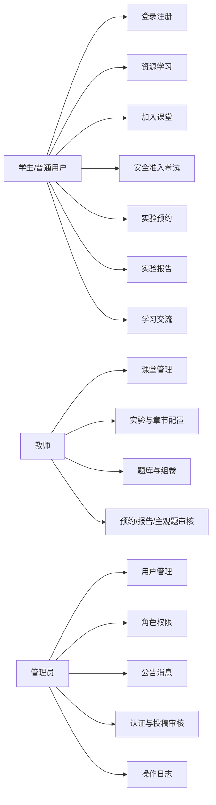
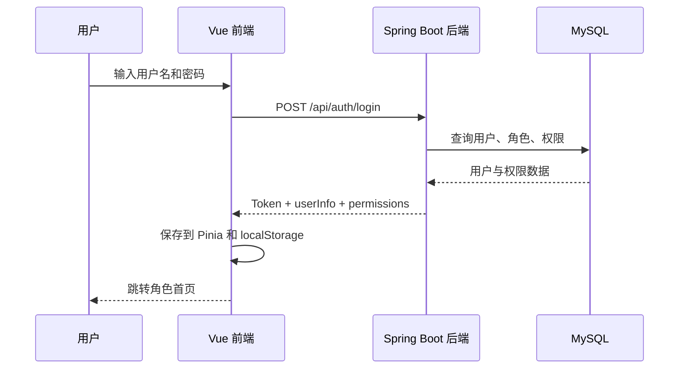
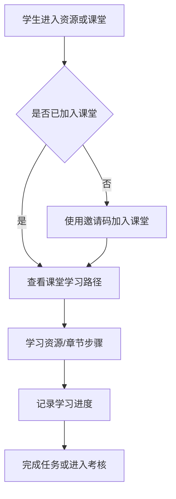
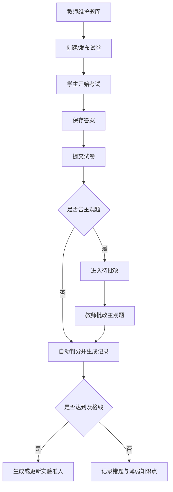
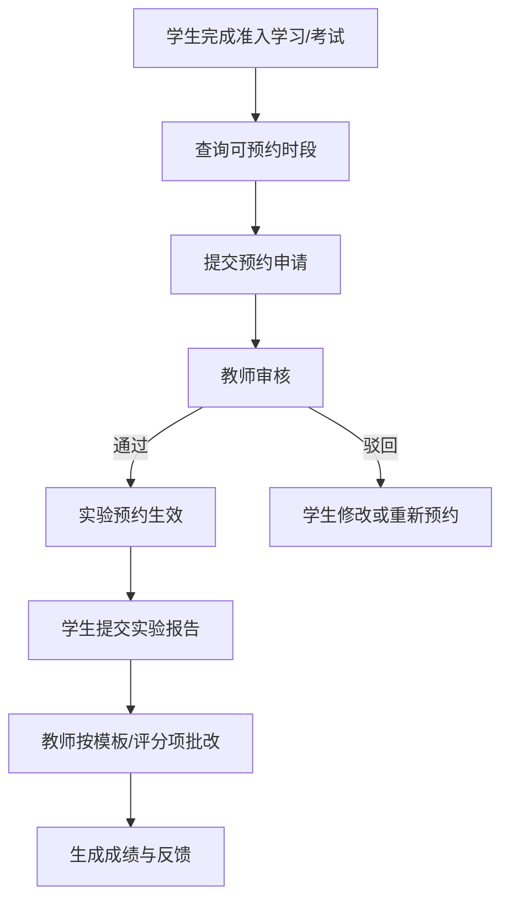
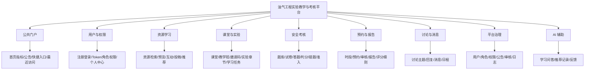
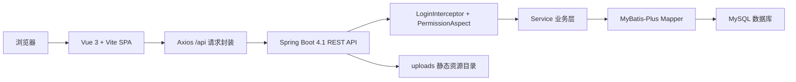
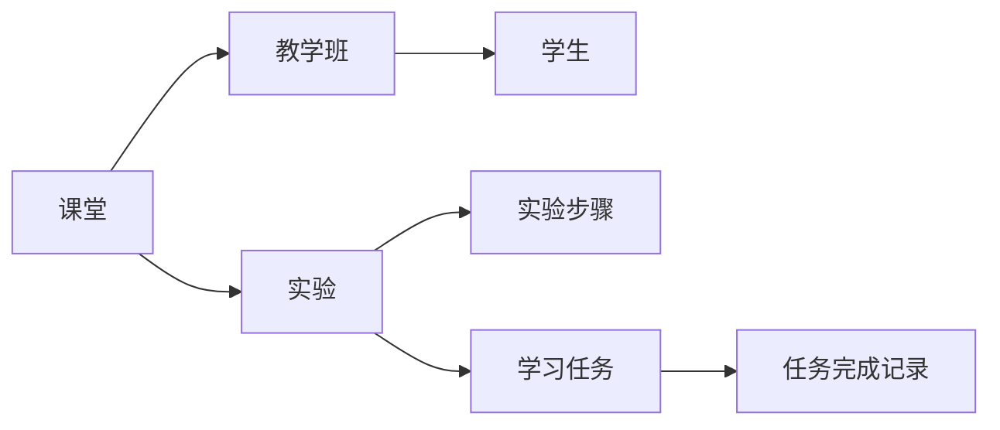
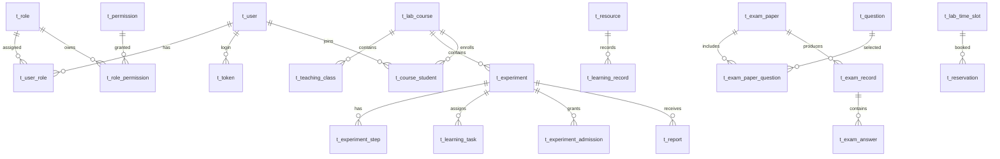

# 油气工程实验教学与考核平台

> 本 README 按《项目开发总结报告2026》模板的章节逻辑整理，用于说明平台设计、业务逻辑、技术架构、数据库、接口、页面与运行方式。项目为前后端分离的油气工程实验教学、安全准入、资源学习与实验过程管理平台。

## 1. 引言

### 1.1 项目背景

油气工程实验教学具有高专业性、高流程性和高安全要求。传统实验教学中，学生预习、风险识别、安全准入考试、实验预约、实验报告提交和教师批改往往分散在线下或多个系统中，难以形成闭环管理。本平台面向油气工程实验教学场景，将公开资源学习、课堂学习路径、安全知识考核、实验预约、报告评价、讨论答疑、教师资源建设和管理员治理统一到一个 Web 系统中。

平台定位为教学与安全考核一体化系统，核心作用包括：

- 为学生提供资源学习、课堂加入、章节学习、准入考试、实验预约、报告提交和成绩查看入口。
- 为教师提供课堂建设、实验路径配置、资源管理、题库与试卷管理、预约审核、报告批改和学习过程跟踪能力。
- 为管理员提供用户、角色、权限、公告、教师认证、资源投稿审核和操作日志管理能力。
- 通过学习记录、考试记录、预约记录、报告记录和资源互动记录沉淀教学过程数据，支撑后续统计分析和教学改进。

### 1.2 术语和缩写词

| 术语 | 说明 |
| --- | --- |
| HSE | Health, Safety and Environment，健康、安全与环境管理。 |
| API | Application Programming Interface，前后端交互接口。 |
| RBAC | Role-Based Access Control，基于角色的访问控制。 |
| CRUD | Create, Read, Update, Delete，增删改查。 |
| VO / DTO | View Object / Data Transfer Object，后端返回对象和请求传输对象。 |
| SQL | Structured Query Language，关系型数据库查询语言。 |
| SPA | Single Page Application，单页前端应用。 |

## 2. 项目概述

### 2.1 项目目标

业务目标：

- 构建油气工程实验教学全过程闭环，从学习资源、课堂任务、安全准入到实验预约和报告评价统一管理。
- 强化实验安全准入机制，学生需完成对应资源学习和考核后再进入实验预约与后续实验环节。
- 支持教师围绕课程、实验、资源、题库和报告模板组织教学过程。
- 支持管理员对用户、权限、公告、审核和日志进行平台级治理。

功能目标：

- 实现用户注册登录、Token 鉴权、角色权限控制和个人资料维护。
- 实现资源中心、课堂学习、章节学习、学习任务、学习记录和讨论交流。
- 实现题库管理、试卷组卷、在线答题、自动判分、主观题批改、错题统计和准入记录。
- 实现实验时段、实验预约、预约审核、报告提交、评分规则和报告批改。
- 实现公告、消息、日程、最近访问、快捷入口、资源投稿、教师认证和操作日志。

技术目标：

- 后端使用 Spring Boot、MyBatis-Plus、MySQL 构建 REST API。
- 前端使用 Vue 3、Pinia、Vue Router、Element Plus、Vite 构建单页应用。
- 通过统一 `Result<T>` 返回结构、Axios 请求封装和前端路由守卫保持前后端交互一致。
- 通过 `Authorization` Token、登录拦截器和 `@RequirePermission` 注解实现接口保护。

### 2.2 业务需求

#### 2.2.1 业务指标

- 学生端应能完成从登录、加入课堂、学习资源、参加考试到预约实验和提交报告的完整流程。
- 教师端应能围绕课程和实验配置教学内容、管理题库试卷、查看学生过程记录并完成审核和批改。
- 管理员端应能完成用户角色权限配置、公告发布、认证审核、投稿审核和日志追踪。
- 平台应保留关键过程数据，包括学习进度、答题记录、准入有效期、预约状态、报告评分和资源互动。

#### 2.2.2 技术指标

- 前后端本地开发端口：前端 `5173`，后端 `8080`。
- 数据库：MySQL，主库名默认为 `ogexpsafetyplatform`，也可通过环境变量覆盖。
- API 统一前缀：`/api`。
- 鉴权方式：登录成功后返回 Token，前端通过 `Authorization` 请求头携带。
- 权限方式：后端 `LoginInterceptor` 注入用户上下文，`PermissionAspect` 校验 `@RequirePermission`。
- 静态上传目录：后端工作目录下 `uploads`，通过 `/uploads/**` 访问。

## 3. 需求分析

### 3.1 目标用户分析

| 用户角色 | 主要职责 | 典型页面 |
| --- | --- | --- |
| 普通用户 / 学生 | 注册登录、查看公开资源、加入课堂、完成学习路径、参加安全考试、预约实验、提交报告、参与讨论。 | `Login.vue`、`Home.vue`、`ResourceCenter.vue`、`CourseList.vue`、`LearningCenter.vue`、`ChapterLearning.vue`、`ExamTaking.vue`、`DiscussionCenter.vue` |
| 教师用户 | 认证教师身份、创建课堂、维护实验章节和学习任务、配置资源、维护题库试卷、审核预约、批改报告和主观题。 | `CourseManagement.vue`、`CourseEditor.vue`、`SafetyExamManager.vue` |
| 系统管理员 | 维护用户、角色、权限、公告、教师认证、资源投稿审核和操作日志。 | `UserManagement.vue`、`RoleManagement.vue`、`PermissionManagement.vue`、`NoticeManagement.vue`、`TeacherCertificationReview.vue`、`ResourceSubmissionReview.vue`、`OperationLog.vue` |

用例关系概览：



### 3.2 功能需求

#### 3.2.1 用户与权限管理

功能描述：

- 用户通过 `/api/auth/login` 登录，后端校验用户名、MD5 密码和账号状态。
- 登录成功后后端返回 Token、用户信息、角色、权限码和菜单数据。
- 前端 Pinia 存储 Token、用户信息、角色和权限，Axios 自动携带 `Authorization`。
- 后端拦截 `/api/**` 请求，排除登录和注册接口；权限注解用于关键接口控制。

业务流程：



#### 3.2.2 课堂学习与资源学习

功能描述：

- 首页、资源中心和课堂列表提供统一学习入口。
- 学生可查看资源、记录学习进度、收藏/评分/评论、加入课堂并进入课程学习路径。
- 课堂学习路径按实验、章节、任务、资源、考试、预约、报告和讨论组织。
- 教师可创建课程、教学班、邀请码，维护实验与学习任务。

业务流程：



#### 3.2.3 安全知识考核与实验准入

功能描述：

- 教师维护题库和试卷，支持单选、多选、判断、主观题等题型。
- 学生进入课堂考试模块后开始答题，客观题自动判分，主观题进入待批改队列。
- 通过安全准入考试后写入实验准入记录，作为实验预约的重要条件。
- 系统提供考试记录、错题统计、通过率和知识点分析接口。

业务流程：



#### 3.2.4 实验预约与报告评价

功能描述：

- 教师或管理员维护实验时段、容量和状态。
- 学生查询可预约时段并提交预约申请。
- 教师审核预约，通过后学生按时参与实验。
- 学生提交实验报告，教师按总分或评分细则批改，可退回修改。

业务流程：



#### 3.2.5 平台治理与公共门户

功能描述：

- 公共门户展示公告、推荐资源、学习指标、最近访问和快捷入口。
- 管理员发布公告、查看操作日志、审核教师认证和资源投稿。
- 消息与日程模块提醒用户处理学习、考试、预约和审核事项。

### 3.3 性能需求

- 前端为 SPA，生产构建后由静态资源服务器或网关托管。
- 后端接口以分页查询为主，用户、资源、课程、考试、报告等列表接口应避免一次性返回过大数据集。
- MyBatis-Plus 分页插件用于分页查询；数据库字段使用逻辑删除减少误删风险。
- 请求层默认超时时间为 10 秒，登录过期或无效 Token 自动退出登录并跳转登录页。

## 4. 系统总体设计

### 4.1 功能架构设计



### 4.2 技术架构设计



技术分层：

- 前端表现层：Vue 页面、Element Plus 组件、路由守卫、Pinia 状态管理。
- 接口层：Controller 接收请求，返回统一 `Result<T>`。
- 业务层：Service 处理登录、课堂、资源、考试、预约、报告、审核等业务逻辑。
- 数据访问层：Mapper 和 MyBatis-Plus 实体完成数据库读写。
- 权限层：Token 表、登录拦截器、用户上下文、权限注解和前端权限码共同控制访问。

## 5. 系统详细设计

### 5.1 用户认证与权限模块

模块描述：

- 后端核心文件：`AuthController`、`UserServiceImpl`、`LoginInterceptor`、`PermissionAspect`、`UserContext`。
- 前端核心文件：`authStore.js`、`request.js`、`router/index.js`、`Login.vue`。
- 数据表：`t_user`、`t_role`、`t_permission`、`t_user_role`、`t_role_permission`、`t_token`、`t_operation_log`。

流程描述：

- 登录接口校验账号密码，失败返回明确错误信息。
- 登录成功创建 Token 并返回权限码；前端存储后用于路由和按钮权限判断。
- 请求接口时前端附带 Token，后端拦截器校验 Token 有效期，并加载角色和权限到线程上下文。
- 标注 `@RequirePermission` 的接口由 AOP 切面二次校验权限。

### 5.2 资源学习模块

模块描述：

- 支持教学视频、文档、图片、链接等资源类型。
- 资源具有课程、实验、知识点、风险标签、状态、作用范围、访问量、评分等属性。
- 学习记录按资源和实验记录进度、学习时长和完成状态。
- 支持资源投稿审核、资源预览、时间轴笔记、互动和推荐。

核心数据表：

- `t_resource`
- `t_learning_record`
- `t_resource_interaction`
- `t_resource_submission`
- `t_resource_timeline_note`
- `t_recommend_record`

### 5.3 课堂与实验模块

模块描述：

- 课堂以 `t_lab_course` 为中心，关联教师、实验、教学班、学生和邀请码。
- 实验以 `t_experiment` 为中心，保存实验目标、地点、风险等级、安全要求、准入条件和评分说明。
- 实验步骤以 `t_experiment_step` 保存，支撑章节式学习和操作流程展示。
- 学习任务以 `t_learning_task` 和 `t_learning_task_record` 保存任务定义与学生完成状态。

核心流程：



### 5.4 安全考核模块

模块描述：

- 题库由 `t_question` 保存题干、类型、选项、答案、解析、知识点、风险类型和难度。
- 试卷由 `t_exam_paper` 保存考试规则，`t_exam_paper_question` 保存题目关系和分值。
- 考试记录由 `t_exam_record` 保存开始、保存、提交、判分和状态。
- 答案明细由 `t_exam_answer` 保存，考试通过后生成 `t_experiment_admission` 准入记录。

关键状态：

- `IN_PROGRESS`：考试进行中。
- `SUBMITTED`：已提交，等待后续处理。
- `GRADED`：已判分。
- `EXPIRED`：考试超时或失效。

### 5.5 预约与报告模块

模块描述：

- `t_lab_time_slot` 保存实验时段、容量、已预约人数和状态。
- `t_reservation` 保存学生预约申请、审核状态和教师意见。
- `t_report` 保存学生实验报告内容、附件、提交状态和时间。
- `t_report_template`、`t_report_rubric_item`、`t_report_score`、`t_report_score_item` 支持报告模板、评分规则和评分明细。

主要状态：

- 预约：`PENDING`、`APPROVED`、`REJECTED`、`CANCELED`。
- 报告：`DRAFT`、`SUBMITTED`、`GRADED`、`RETURNED`。

### 5.6 管理员治理模块

模块描述：

- 用户管理：查询、创建、更新、删除用户和分配角色。
- 角色权限：查询角色、配置权限树。
- 公告管理：公告列表、新增、编辑、发布、下线、删除。
- 教师认证：审核普通用户提交的教师认证申请。
- 资源投稿：审核用户提交的公开资源。
- 操作日志：记录登录、退出、用户管理等关键操作。

## 6. 数据库设计

### 6.1 概念结构设计

核心实体关系：



### 6.2 逻辑结构设计

当前主 SQL 文件 `backend/OG-ExpSafetyPlatform/src/main/resources/sql/ogexpsafetyplatform.sql` 定义 43 张表：

| 领域 | 数据表 |
| --- | --- |
| 用户权限 | `t_user`、`t_role`、`t_permission`、`t_user_role`、`t_role_permission`、`t_token`、`t_teacher_certification`、`t_operation_log` |
| 门户消息 | `t_portal_notice`、`t_portal_message`、`t_recent_visit`、`t_user_shortcut` |
| 课堂实验 | `t_lab_course`、`t_teaching_class`、`t_course_student`、`t_class_invite`、`t_experiment`、`t_experiment_step` |
| 学习资源 | `t_resource`、`t_learning_record`、`t_learning_task`、`t_learning_task_record`、`t_resource_interaction`、`t_resource_submission`、`t_resource_timeline_note`、`t_recommend_record` |
| 考试准入 | `t_question`、`t_exam_paper`、`t_exam_paper_question`、`t_exam_record`、`t_exam_answer`、`t_experiment_admission` |
| 预约报告 | `t_lab_time_slot`、`t_reservation`、`t_report`、`t_report_template`、`t_report_rubric_item`、`t_report_score`、`t_report_score_item` |
| 交流与 AI | `t_discussion_topic`、`t_discussion_reply`、`t_ai_chat_record` |

示例账号数据在 SQL 中已提供，默认密码为 `123456` 的 MD5 值：

| 用户名 | 角色/身份 | 说明 |
| --- | --- | --- |
| `admin` | 管理员 | 平台治理中心账号。 |
| `teacher_wang` | 普通用户 + 已认证教师 | 石油工程课堂教师。 |
| `teacher_li` | 普通用户 + 已认证教师 | 安全工程课堂教师。 |
| `student_zhang` | 普通用户 | 石油工程学生。 |
| `student_li` | 普通用户 | 油气储运学生。 |
| `student_chen` | 普通用户 | 安全工程学生。 |
| `user_oilfan` | 普通用户 | 公开学习者。 |
| `user_guest` | 普通用户 | 待认证/公开学习者。 |

## 7. 完成情况

### 7.1 系统描述

仓库结构：

```text
D:\Users\hanghang\xiaoxueqi
├── backend
│   └── OG-ExpSafetyPlatform
│       ├── pom.xml
│       ├── .env.example
│       └── src
│           ├── main
│           │   ├── java/com/cupk
│           │   │   ├── controller
│           │   │   ├── service
│           │   │   ├── mapper
│           │   │   ├── pojo
│           │   │   ├── dto
│           │   │   ├── vo
│           │   │   ├── interceptor
│           │   │   └── config
│           │   └── resources
│           │       ├── application.yml
│           │       └── sql/ogexpsafetyplatform.sql
│           └── test
└── frontend
    └── og-expsafetyplatform
        ├── package.json
        ├── vite.config.js
        └── src
            ├── api
            ├── router
            ├── stores
            ├── layouts
            ├── views
            ├── components
            └── utils
```

已完成模块概览：

- 系统功能模块：用户权限、门户首页、资源学习、课堂管理、实验章节、学习任务、题库试卷、在线考试、实验准入、预约审核、报告评价、讨论交流、消息日程、教师认证、资源投稿、AI 问答、统计看板、操作日志。
- 数据表：主 SQL 定义 43 张业务表。
- 后端控制器：管理员、AI、认证、课程、看板、讨论、考试、试卷、考试统计、实验、文件、学习记录、学习任务、权限、门户、题库、推荐、报告、预约、资源、资源投稿、角色、教师认证、用户等。
- 前端页面：公共登录/首页/个人中心/消息/讨论，学生资源/课堂/学习/章节/答题，教师课堂/课程编辑/安全考试管理，管理员用户/角色/权限/公告/认证/投稿/日志。

### 7.2 功能展示说明

#### 7.2.1 登录与注册

- 访问地址：`http://localhost:5173/login`
- 后端接口：`POST /api/auth/login`、`POST /api/auth/register`、`POST /api/auth/logout`
- 相关页面：`frontend/og-expsafetyplatform/src/views/common/Login.vue`
- 相关表：`t_user`、`t_role`、`t_permission`、`t_user_role`、`t_role_permission`、`t_token`
- 业务说明：登录成功后进入用户或管理员首页；登录失败时展示后端返回的“用户名或密码错误”“账号已被禁用，请联系管理员”等提示。

#### 7.2.2 公共资源学习

- 访问地址：`/resources`
- 后端接口：`GET /api/resources`、`GET /api/resources/{id}`、`POST /api/resources/{id}/view`、`POST /api/resources/{id}/interaction`
- 相关页面：`ResourceCenter.vue`、`ResourceViewer.vue`
- 相关表：`t_resource`、`t_learning_record`、`t_resource_interaction`、`t_resource_timeline_note`
- 业务说明：用户浏览油气工程实验资源，完成预习、记录进度、查看资源预览并产生互动数据。

#### 7.2.3 我的课堂与课堂学习路径

- 访问地址：`/classrooms`、`/classrooms/:courseId/learn`
- 后端接口：`GET /api/courses`、`POST /api/courses/join`、`GET /api/learning-tasks/experiments/{experimentId}/path`
- 相关页面：`CourseList.vue`、`LearningCenter.vue`、`ChapterLearning.vue`
- 相关表：`t_lab_course`、`t_teaching_class`、`t_course_student`、`t_class_invite`、`t_experiment`、`t_experiment_step`、`t_learning_task`
- 业务说明：学生通过邀请码加入课堂，按实验学习路径完成资源、任务、考试、预约、报告和讨论。

#### 7.2.4 安全题库、组卷与答题

- 教师入口：`/teacher/courses/:courseId/safety-exams`
- 学生答题入口：`/classrooms/:courseId/exams/:paperId/take`
- 后端接口：`/api/questions`、`/api/exams/papers`、`/api/exams/{paperId}/start`、`/api/exams/{recordId}/submit`
- 相关页面：`SafetyExamManager.vue`、`ExamTaking.vue`
- 相关表：`t_question`、`t_exam_paper`、`t_exam_paper_question`、`t_exam_record`、`t_exam_answer`、`t_experiment_admission`
- 业务说明：教师维护题库和试卷，学生在线答题，系统判分并根据及格线生成实验准入记录。

#### 7.2.5 实验预约与报告评价

- 学生入口：课堂学习路径内 `reservation`、`report` 模块。
- 教师入口：课堂学习路径和课程编辑相关页面。
- 后端接口：`/api/reservations`、`/api/reports`
- 相关表：`t_lab_time_slot`、`t_reservation`、`t_report`、`t_report_template`、`t_report_rubric_item`、`t_report_score`
- 业务说明：学生选择可预约时段提交申请，教师审核；实验后学生提交报告，教师按评分规则批改。

#### 7.2.6 管理员治理

- 访问地址：`/admin/users`、`/admin/roles`、`/admin/permissions`、`/admin/notices`、`/admin/teacher-certifications`、`/admin/resource-submissions`、`/admin/logs`
- 后端接口：`/api/users`、`/api/roles`、`/api/permissions/tree`、`/api/admin/notices`、`/api/admin/teacher-certifications`、`/api/admin/resource-submissions`、`/api/admin/operation-logs`
- 相关表：用户权限表、公告表、认证表、投稿表、日志表。
- 业务说明：管理员负责平台基础数据治理、权限配置和审核流转。

### 7.3 遗留问题

基于当前代码状态，建议后续关注：

- 当前仓库存在较多未提交业务改动和已删除迁移脚本，应在正式交付前明确是否为最终版本。
- 安全性方面，密码目前使用 MD5，应在生产环境改为 BCrypt、Argon2 或其他带盐哈希。
- Token 存储在数据库并由前端 localStorage 保存，正式部署时应补充刷新机制、设备管理和 XSS 防护策略。
- 目前 README 未包含页面截图和后台 SQL 日志截图；如果用于正式课程报告，应按模板另行补充截图材料。
- 部分统计、AI 推荐和资源预览能力依赖演示数据，部署真实环境前需要补充数据导入和运维说明。

## 8. AI 辅助

### 8.1 AI 工具介绍

本项目开发和说明整理过程中可使用 ChatGPT / Codex 等 AI 工具辅助需求梳理、代码阅读、模块归纳、文档撰写、测试建议和错误分析。AI 适合承担重复性分析和初稿生成，但涉及业务规则、数据库脚本、接口兼容性和安全策略时仍需人工复核。

### 8.2 AI 工具主要用途

| 序号 | 项目阶段 | AI 可参与占比 | 具体用途 |
| --- | --- | ---: | --- |
| 1 | 需求分析 | 40% | 梳理学生、教师、管理员角色职责和教学闭环业务流程。 |
| 2 | 数据库设计 | 30% | 根据实体关系检查表结构覆盖范围，辅助生成 ER 图说明。 |
| 3 | 编码开发 | 20% | 生成局部代码示例、接口封装建议和页面逻辑调整方案。 |
| 4 | Bug 调试 | 40% | 分析登录错误提示、接口权限、构建警告和请求失败原因。 |
| 5 | 测试 | 35% | 设计登录、资源学习、考试、预约、报告批改等验收用例。 |
| 6 | 文档撰写 | 60% | 按总结报告模板生成 README、模块说明和接口清单。 |
| 7 | 系统部署 | 20% | 整理本地运行命令、环境变量和数据库初始化步骤。 |

示例应用案例：

- 输入平台源码结构，获得后端 Controller、Service、Mapper、POJO 分层说明。
- 输入 Word 总结报告模板，获得 README 章节结构。
- 输入路由文件，归纳前端页面和角色入口。
- 输入 SQL 建表脚本，生成数据表分组和核心实体关系。
- 输入登录相关代码，分析 Token 鉴权、权限码和路由守卫逻辑。
- 输入考试相关接口，整理题库、组卷、答题、判分和准入流程。
- 输入预约和报告相关接口，整理实验预约与报告评分流程。

## 9. 经验总结

- 业务建模方面，油气实验教学不应只抽象为普通课程系统，应突出安全准入、风险识别、实验预约和报告复盘。
- 技术实现方面，前后端分离能提升页面迭代效率，但必须统一接口返回结构、错误提示和权限码命名。
- 权限设计方面，角色只能解决粗粒度入口问题，具体接口仍需要权限注解或等价机制进行后端校验。
- 数据设计方面，学习记录、考试记录、预约记录和报告评分是教学闭环的关键证据，应完整保留。
- 项目管理方面，迁移脚本、演示数据和最终 SQL 应保持一致，避免后续部署时无法判断哪个脚本为准。
- AI 使用方面，AI 适合辅助归纳和生成文档，但不能替代对真实代码、数据库和运行结果的核查。

## 附录 A：模块及接口明细

### A.1 主要接口分组

| 模块 | API 前缀 | 请求方式示例 | 对应页面 |
| --- | --- | --- | --- |
| 登录注册 | `/api/auth` | `POST /login`、`POST /register`、`POST /logout`、`PUT /password` | `Login.vue`、`ProfileCenter.vue` |
| 用户管理 | `/api/users` | `GET`、`GET /me`、`PUT /me`、`POST`、`PUT`、`DELETE` | `UserManagement.vue`、`ProfileCenter.vue` |
| 角色权限 | `/api/roles`、`/api/permissions` | `GET /roles`、`PUT /roles/{roleId}/permissions`、`GET /permissions/tree` | `RoleManagement.vue`、`PermissionManagement.vue` |
| 门户首页 | `/api/portal` | `GET /home`、`GET /notices`、`GET /messages`、`GET /calendar`、`GET /search` | `Home.vue`、`MessageCenter.vue` |
| 课堂管理 | `/api/courses` | `GET`、`POST`、`PUT /{id}`、`POST /join`、`POST /{courseId}/students/import` | `CourseList.vue`、`CourseManagement.vue`、`CourseEditor.vue` |
| 实验管理 | `/api/experiments` | `GET`、`GET /{id}`、`POST`、`PUT /{id}`、`POST /{id}/steps` | `LearningCenter.vue`、`ChapterLearning.vue`、`CourseEditor.vue` |
| 学习任务 | `/api/learning-tasks`、`/api/learning-records` | `GET`、`POST`、`PUT /progress`、`GET /my` | `LearningCenter.vue`、`ChapterLearning.vue` |
| 资源学习 | `/api/resources` | `GET`、`GET /{id}`、`POST /upload`、`POST /{id}/interaction` | `ResourceCenter.vue`、`ResourceViewer.vue` |
| 资源投稿 | `/api/resource-submissions`、`/api/admin/resource-submissions` | `POST`、`GET /my`、`PUT /{id}/approve`、`PUT /{id}/reject` | `ResourceSubmissionReview.vue` |
| 题库 | `/api/questions` | `GET`、`GET /{id}`、`POST`、`POST /batch`、`PUT /{id}`、`DELETE /{id}` | `SafetyExamManager.vue` |
| 试卷 | `/api/exams/papers` | `GET`、`POST`、`PUT /{id}`、`POST /{id}/smart-assemble` | `SafetyExamManager.vue` |
| 在线考试 | `/api/exams` | `GET /available`、`POST /{paperId}/start`、`PUT /{recordId}/answers`、`POST /{recordId}/submit` | `ExamTaking.vue`、`LearningCenter.vue` |
| 考试统计 | `/api/exams/statistics` | `GET /overview`、`GET /pending-grading`、`PUT /grade-short-answer` | `SafetyExamManager.vue` |
| 预约 | `/api/reservations` | `GET /time-slots`、`POST`、`GET /my`、`GET /pending`、`PUT /{id}/review` | `LearningCenter.vue` |
| 报告 | `/api/reports` | `POST`、`PUT /{id}`、`PUT /{id}/submit`、`GET /pending`、`PUT /{id}/grade` | `LearningCenter.vue` |
| 讨论 | `/api/discussions` | `GET`、`POST`、`POST /{id}/replies`、`PUT /{id}/status` | `DiscussionCenter.vue` |
| AI 问答 | `/api/ai` | `POST /ask`、`GET /records`、`PUT /records/{id}/feedback` | `LearningCenter.vue` |
| 管理员门户 | `/api/admin` | `GET /notices`、`POST /notices`、`GET /operation-logs` | `NoticeManagement.vue`、`OperationLog.vue` |
| 认证审核 | `/api/teacher-certifications`、`/api/admin/teacher-certifications` | `POST`、`GET /my`、`PUT /{id}/approve`、`PUT /{id}/reject` | `TeacherCertificationReview.vue` |

### A.2 技术实现点

- Spring Boot 4.1.0
- Java 21
- MyBatis-Plus 3.5.16
- MySQL Connector/J
- Vue 3.5
- Pinia 3.0
- Vue Router 4.6
- Element Plus 2.14
- Axios 1.18
- ECharts 6.1
- Vite 8

### A.3 本地运行方式

#### 1. 初始化数据库

在 MySQL 中创建数据库并导入主 SQL：

```sql
CREATE DATABASE ogexpsafetyplatform DEFAULT CHARACTER SET utf8mb4 COLLATE utf8mb4_unicode_ci;
USE ogexpsafetyplatform;
SOURCE backend/OG-ExpSafetyPlatform/src/main/resources/sql/ogexpsafetyplatform.sql;
```

如需使用 `.env.example` 中的库名，也可以创建 `og_exp_safety`，但需要保证 `MYSQL_URL` 与实际数据库一致。

#### 2. 配置后端环境变量

后端默认读取：

```text
MYSQL_URL=jdbc:mysql://localhost:3306/ogexpsafetyplatform?useUnicode=true&characterEncoding=utf8&serverTimezone=Asia/Shanghai
MYSQL_USERNAME=root
MYSQL_PASSWORD=your_local_mysql_password
```

#### 3. 启动后端

```powershell
cd D:\Users\hanghang\xiaoxueqi\backend\OG-ExpSafetyPlatform
.\mvnw.cmd spring-boot:run
```

后端默认地址：

```text
http://localhost:8080
```

#### 4. 启动前端

```powershell
cd D:\Users\hanghang\xiaoxueqi\frontend\og-expsafetyplatform
pnpm install
pnpm dev
```

前端默认地址：

```text
http://localhost:5173
```

Vite 已配置代理：

- `/api` -> `http://localhost:8080`
- `/uploads` -> `http://localhost:8080`

#### 5. 构建前端

```powershell
cd D:\Users\hanghang\xiaoxueqi\frontend\og-expsafetyplatform
pnpm build
```

#### 6. 运行后端测试

```powershell
cd D:\Users\hanghang\xiaoxueqi\backend\OG-ExpSafetyPlatform
.\mvnw.cmd test
```

当前测试目录包含：

- `OgExpSafetyPlatformApplicationTests.java`
- `ExamServiceImplTest.java`
- `ReportServiceImplTest.java`

## 附录 B：AI 功能模块代码说明

平台包含 AI 问答与推荐记录相关模块：

- 后端控制器：`AiController`
- 后端服务：`AiChatService`、`AiChatServiceImpl`
- 推荐接口：`RecommendController`、`RecommendService`
- 请求对象：`AiAskDTO`、`RecommendQueryDTO`
- 数据表：`t_ai_chat_record`、`t_recommend_record`
- 前端接口：`frontend/og-expsafetyplatform/src/api/ai.js`

当前 AI 模块主要作为学习辅助入口，用于接收用户问题、保存问答记录、记录反馈和支撑资源推荐。正式接入大模型服务时，应补充模型服务配置、调用限流、敏感内容过滤、失败降级和日志脱敏策略。
