# 油气工程实验教学与安全考核平台 — ER 图

> 基于 3 个建表 SQL 生成，共 **24 张表**，分为 **6 个模块**。
>
> 字段说明见下方【表字段详解】。

```mermaid
erDiagram
    %% ==================== 用户权限模块 ====================
    t_user {
        bigint id PK
        varchar username UK
        varchar password
        varchar real_name
        varchar phone
        tinyint status
        datetime create_time
        datetime update_time
    }

    t_role {
        bigint id PK
        varchar role_name
        varchar role_code UK
        varchar description
    }

    t_permission {
        bigint id PK
        varchar name
        varchar code UK
        tinyint type
        bigint parent_id FK
        varchar path
        varchar icon
        int sort
        datetime create_time
    }

    t_user_role {
        bigint user_id PK_FK
        bigint role_id PK_FK
    }

    t_role_permission {
        bigint role_id PK_FK
        bigint permission_id PK_FK
    }

    t_token {
        bigint id PK
        bigint user_id FK
        varchar token UK
        datetime expire_time
        datetime create_time
    }

    %% ==================== 实验教学模块 ====================
    t_lab_course {
        bigint id PK
        varchar course_code UK
        varchar course_name
        varchar direction
        bigint teacher_id FK
        varchar semester
        text description
        varchar cover_url
        tinyint status
        int sort
        datetime create_time
        datetime update_time
        tinyint deleted
    }

    t_course_student {
        bigint id PK
        bigint course_id FK
        bigint student_id FK
        varchar semester
        tinyint status
        datetime join_time
        datetime create_time
        datetime update_time
        tinyint deleted
    }

    t_experiment {
        bigint id PK
        bigint course_id FK
        varchar exp_code UK
        varchar exp_name
        text objective
        text principle
        text equipment
        varchar risk_level
        int duration_minutes
        int safety_pass_score
        tinyint reservation_enabled
        tinyint status
        int sort
        datetime create_time
        datetime update_time
        tinyint deleted
    }

    t_experiment_step {
        bigint id PK
        bigint experiment_id FK
        int step_no
        varchar title
        text content
        text safety_tip
        tinyint required_flag
        int estimated_minutes
        datetime create_time
        datetime update_time
        tinyint deleted
    }

    t_resource {
        bigint id PK
        bigint experiment_id FK
        varchar title
        varchar resource_type
        varchar url
        varchar file_path
        bigint file_size
        tinyint required_flag
        int view_count
        tinyint status
        int sort
        bigint upload_user_id FK
        datetime create_time
        datetime update_time
        tinyint deleted
    }

    t_safety_knowledge {
        bigint id PK
        bigint experiment_id FK
        varchar knowledge_point
        varchar risk_type
        text content
        bigint related_step_id FK
        tinyint status
        datetime create_time
        datetime update_time
        tinyint deleted
    }

    t_learning_record {
        bigint id PK
        bigint student_id FK
        bigint resource_id FK
        bigint experiment_id FK
        decimal progress
        int duration_seconds
        tinyint finish_flag
        datetime first_time
        datetime last_time
        datetime create_time
        datetime update_time
        tinyint deleted
    }

    %% ==================== 考试模块 ====================
    t_question {
        bigint id PK
        varchar type
        text content
        json options
        varchar answer
        int score
        varchar analysis
        varchar knowledge_point
        varchar difficulty
        bigint course_id FK
        bigint create_by FK
        datetime create_time
        datetime update_time
        tinyint is_deleted
    }

    t_exam_paper {
        bigint id PK
        varchar title
        varchar description
        bigint course_id FK
        bigint experiment_id FK
        int total_score
        int pass_score
        int duration
        bigint teacher_id FK
        varchar status
        datetime start_time
        datetime end_time
        datetime create_time
        datetime update_time
        tinyint is_deleted
    }

    t_exam_paper_question {
        bigint id PK
        bigint paper_id FK
        bigint question_id FK
        int score
        int order_num
    }

    t_exam_record {
        bigint id PK
        bigint student_id FK
        bigint paper_id FK
        bigint experiment_id FK
        int total_score
        int objective_score
        int subjective_score
        varchar status
        tinyint passed
        datetime start_time
        datetime submit_time
        datetime create_time
        datetime update_time
        tinyint deleted
    }

    t_exam_answer {
        bigint id PK
        bigint record_id FK
        bigint question_id FK
        bigint knowledge_id FK
        varchar student_answer
        tinyint is_correct
        tinyint correct_flag
        int score
    }

    %% ==================== 预约模块 ====================
    t_lab_time_slot {
        bigint id PK
        bigint lab_id
        bigint experiment_id FK
        date date
        time start_time
        time end_time
        int capacity
        int booked_count
        varchar status
        bigint create_by FK
        datetime create_time
        datetime update_time
    }

    t_reservation {
        bigint id PK
        bigint student_id FK
        bigint time_slot_id FK
        bigint lab_id
        bigint experiment_id FK
        varchar purpose
        varchar status
        bigint teacher_id FK
        varchar review_comment
        datetime review_time
        datetime create_time
        datetime update_time
        tinyint deleted
    }

    %% ==================== 报告模块 ====================
    t_report {
        bigint id PK
        bigint student_id FK
        bigint experiment_id FK
        varchar title
        text content
        varchar file_url
        varchar status
        datetime submit_time
        datetime latest_submit_time
        datetime create_time
        datetime update_time
        tinyint is_deleted
    }

    t_report_score {
        bigint id PK
        bigint report_id FK
        bigint teacher_id FK
        int score
        varchar comment
        tinyint is_latest
        datetime create_time
        datetime grade_time
    }

    %% ==================== 推荐与AI模块 ====================
    t_recommend_record {
        bigint id PK
        bigint student_id FK
        bigint experiment_id FK
        bigint resource_id FK
        decimal total_score
        json score_breakdown
        varchar reason
        tinyint clicked
        datetime create_time
    }

    t_ai_chat_record {
        bigint id PK
        bigint user_id FK
        varchar scene
        text question
        text answer
        varchar tool_name
        bigint experiment_id FK
        text manual_revision
        datetime create_time
    }

    %% ==================== 表关系 ====================

    %% 用户权限
    t_user ||--o{ t_user_role : ""
    t_role ||--o{ t_user_role : ""
    t_role ||--o{ t_role_permission : ""
    t_permission ||--o{ t_role_permission : ""
    t_permission ||--o{ t_permission : ""
    t_user ||--o{ t_token : ""

    %% 实验教学
    t_user ||--o{ t_lab_course : ""
    t_lab_course ||--o{ t_course_student : ""
    t_user ||--o{ t_course_student : ""
    t_lab_course ||--o{ t_experiment : ""
    t_experiment ||--o{ t_experiment_step : ""
    t_experiment ||--o{ t_resource : ""
    t_user ||--o{ t_resource : ""
    t_experiment ||--o{ t_safety_knowledge : ""
    t_experiment_step ||--o{ t_safety_knowledge : ""
    t_user ||--o{ t_learning_record : ""
    t_resource ||--o{ t_learning_record : ""
    t_experiment ||--o{ t_learning_record : ""

    %% 考试
    t_lab_course ||--o{ t_question : ""
    t_user ||--o{ t_question : ""
    t_lab_course ||--o{ t_exam_paper : ""
    t_experiment ||--o{ t_exam_paper : ""
    t_user ||--o{ t_exam_paper : ""
    t_exam_paper ||--o{ t_exam_paper_question : ""
    t_question ||--o{ t_exam_paper_question : ""
    t_user ||--o{ t_exam_record : ""
    t_exam_paper ||--o{ t_exam_record : ""
    t_experiment ||--o{ t_exam_record : ""
    t_exam_record ||--o{ t_exam_answer : ""
    t_question ||--o{ t_exam_answer : ""

    %% 预约
    t_experiment ||--o{ t_lab_time_slot : ""
    t_user ||--o{ t_lab_time_slot : ""
    t_user ||--o{ t_reservation : ""
    t_lab_time_slot ||--o{ t_reservation : ""
    t_experiment ||--o{ t_reservation : ""
    t_user ||--o{ t_reservation : ""

    %% 报告
    t_user ||--o{ t_report : ""
    t_experiment ||--o{ t_report : ""
    t_report ||--o{ t_report_score : ""
    t_user ||--o{ t_report_score : ""

    %% 推荐与AI
    t_user ||--o{ t_recommend_record : ""
    t_experiment ||--o{ t_recommend_record : ""
    t_resource ||--o{ t_recommend_record : ""
    t_user ||--o{ t_ai_chat_record : ""
    t_experiment ||--o{ t_ai_chat_record : ""
```



## 模块总览

| 模块 | 表数 | 表名 |
|------|------|------|
| 🔐 用户权限 | 6 | `t_user` · `t_role` · `t_permission` · `t_user_role` · `t_role_permission` · `t_token` |
| 📚 实验教学 | 7 | `t_lab_course` · `t_course_student` · `t_experiment` · `t_experiment_step` · `t_resource` · `t_safety_knowledge` · `t_learning_record` |
| 📝 考试 | 5 | `t_question` · `t_exam_paper` · `t_exam_paper_question` · `t_exam_record` · `t_exam_answer` |
| 📅 预约 | 2 | `t_lab_time_slot` · `t_reservation` |
| 📄 报告 | 2 | `t_report` · `t_report_score` |
| 🤖 推荐与AI | 2 | `t_recommend_record` · `t_ai_chat_record` |

## 核心关系说明

```
t_user ──→ t_user_role ←── t_role ──→ t_role_permission ←── t_permission
  │                                                             │
  │  teacher_id / student_id / create_by                       parent_id (菜单树)
  │                                                             │
  ▼                                                             ▼
t_lab_course ──→ t_experiment ──→ t_experiment_step    菜单栏 + 按钮权限
  │                  │
  │                  ├──→ t_resource ──→ t_learning_record
  │                  ├──→ t_safety_knowledge
  │                  ├──→ t_exam_paper ──→ t_exam_paper_question ←── t_question
  │                  │       │
  │                  │       └──→ t_exam_record ──→ t_exam_answer
  │                  │
  │                  ├──→ t_lab_time_slot ──→ t_reservation
  │                  │
  │                  ├──→ t_report ──→ t_report_score
  │                  │
  │                  └──→ t_recommend_record (← t_resource)
  │
  └──→ t_course_student ←── t_user
```

## 表字段详解

### 🔐 用户权限模块

**t_user — 用户表**
\| 字段 \| 类型 \| 说明 \|
\|------\|------\|------\|
\| id \| bigint \| 主键 \|
\| username \| varchar(50) \| 用户名/学工号，唯一 \|
\| password \| varchar(64) \| MD5加密密码 \|
\| real_name \| varchar(50) \| 真实姓名 \|
\| phone \| varchar(30) \| 手机号 \|
\| status \| tinyint \| 状态：1启用 0禁用 \|

**t_role — 角色表**
\| 字段 \| 类型 \| 说明 \|
\|------\|------\|------\|
\| id \| bigint \| 主键 \|
\| role_name \| varchar(50) \| 角色名称 \|
\| role_code \| varchar(50) \| 角色编码：ADMIN / TEACHER / STUDENT / LAB_ADMIN \|
\| description \| varchar(255) \| 描述 \|

**t_permission — 权限表**
\| 字段 \| 类型 \| 说明 \|
\|------\|------\|------\|
\| id \| bigint \| 主键 \|
\| name \| varchar(100) \| 权限名称 \|
\| code \| varchar(100) \| 权限编码，如 course:create \|
\| type \| tinyint \| 1=菜单 2=按钮/接口权限 \|
\| parent_id \| bigint \| 父权限ID，构建菜单树 \|
\| path \| varchar(255) \| 前端路由路径 \|
\| icon \| varchar(100) \| 图标 \|
\| sort \| int \| 排序 \|

### 📚 实验教学模块

**t_lab_course — 课程表**
\| 字段 \| 类型 \| 说明 \|
\|------\|------\|------\|
\| course_code \| varchar(50) \| 课程编码，唯一 \|
\| course_name \| varchar(100) \| 课程名称 \|
\| direction \| varchar(50) \| 专业方向 \|
\| teacher_id \| bigint \| 授课教师ID → t_user \|
\| semester \| varchar(20) \| 学期 \|

**t_experiment — 实验表**
\| 字段 \| 类型 \| 说明 \|
\|------\|------\|------\|
\| course_id \| bigint \| 所属课程ID → t_lab_course \|
\| exp_code \| varchar(50) \| 实验编码 \|
\| exp_name \| varchar(120) \| 实验名称 \|
\| risk_level \| varchar(20) \| 风险等级：LOW / MEDIUM / HIGH \|
\| safety_pass_score \| int \| 安全准入考试及格分 \|
\| reservation_enabled \| tinyint \| 是否开放预约 \|

### 📝 考试模块

**t_question — 题库表**
\| 字段 \| 类型 \| 说明 \|
\|------\|------\|------\|
\| type \| varchar(20) \| 题型：SINGLE / MULTIPLE / JUDGE / SHORT \|
\| content \| text \| 题目内容 \|
\| options \| json \| 选项JSON（选择题） \|
\| answer \| varchar(500) \| 正确答案 \|
\| difficulty \| varchar(20) \| 难度：EASY / MEDIUM / HARD \|
\| knowledge_point \| varchar(200) \| 知识点标签 \|

**t_exam_paper — 试卷表**
\| 字段 \| 类型 \| 说明 \|
\|------\|------\|------\|
\| total_score \| int \| 总分 \|
\| pass_score \| int \| 及格线 \|
\| duration \| int \| 考试时长（分钟） \|
\| status \| varchar(20) \| DRAFT / PUBLISHED / CLOSED \|

**t_exam_record — 考试记录表**
\| 字段 \| 类型 \| 说明 \|
\|------\|------\|------\|
\| student_id \| bigint \| 考生ID → t_user \|
\| paper_id \| bigint \| 试卷ID → t_exam_paper \|
\| objective_score \| int \| 客观题得分 \|
\| subjective_score \| int \| 主观题得分 \|
\| passed \| tinyint \| 是否通过 \|

### 📅 预约模块

**t_lab_time_slot — 实验室时间段表**
\| 字段 \| 类型 \| 说明 \|
\|------\|------\|------\|
\| lab_id \| bigint \| 实验室编号 \|
\| date \| date \| 日期 \|
\| start_time \| time \| 开始时间 \|
\| end_time \| time \| 结束时间 \|
\| capacity \| int \| 容量 \|
\| booked_count \| int \| 已预约人数 \|

**t_reservation — 预约表**
\| 字段 \| 类型 \| 说明 \|
\|------\|------\|------\|
\| status \| varchar(20) \| PENDING / APPROVED / REJECTED / CANCELLED \|
\| teacher_id \| bigint \| 审核教师 → t_user \|
\| review_comment \| varchar(500) \| 审核意见 \|

### 📄 报告模块

**t_report — 实验报告表**
\| 字段 \| 类型 \| 说明 \|
\|------\|------\|------\|
\| status \| varchar(20) \| DRAFT / SUBMITTED / GRADED \|
\| submit_time \| datetime \| 提交时间 \|

**t_report_score — 报告评分表**
\| 字段 \| 类型 \| 说明 \|
\|------\|------\|------\|
\| score \| int \| 分数 \|
\| comment \| varchar(500) \| 评语 \|
\| is_latest \| tinyint \| 是否最新评分（支持多次批改） \|

### 🤖 推荐与AI模块

**t_recommend_record — 推荐记录表**
\| 字段 \| 类型 \| 说明 \|
\|------\|------\|------\|
\| total_score \| decimal \| 推荐总分 \|
\| score_breakdown \| json \| 各维度评分明细JSON \|
\| reason \| varchar(500) \| 推荐理由 \|
\| clicked \| tinyint \| 用户是否点击 \|

**t_ai_chat_record — AI对话记录表**
\| 字段 \| 类型 \| 说明 \|
\|------\|------\|------\|
\| scene \| varchar(50) \| 场景：SAFETY_QA / ERROR_EXPLAIN / REPORT_SUGGEST \|
\| question \| text \| 用户问题 \|
\| answer \| text \| AI回答 \|
\| manual_revision \| text \| 人工修订内容 \|
