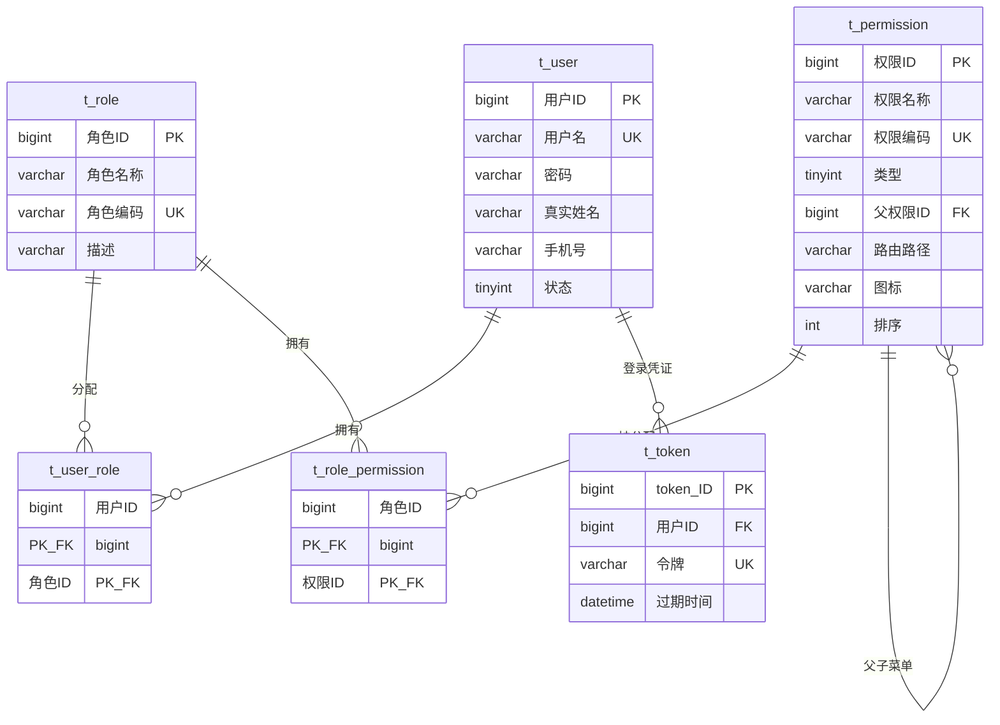
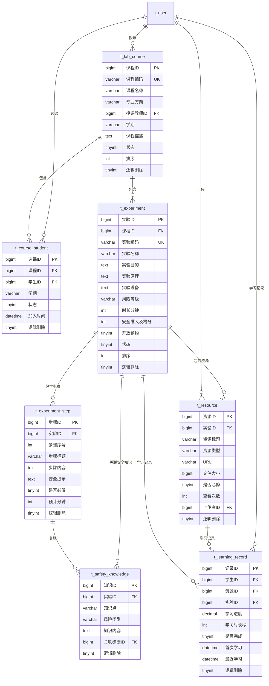
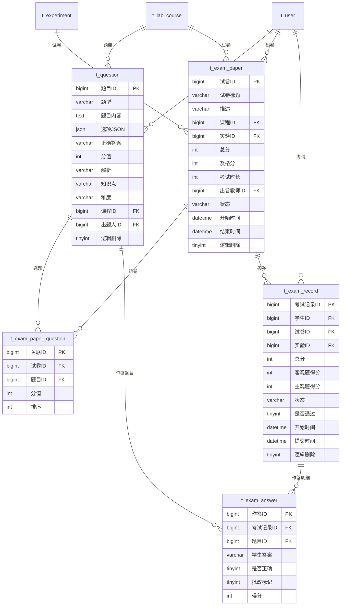
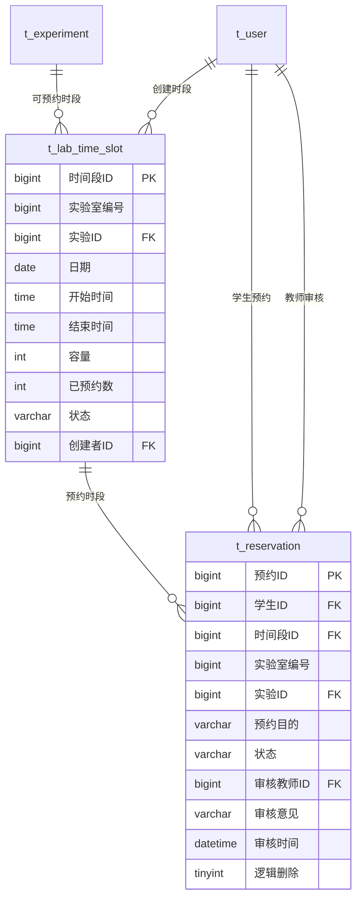
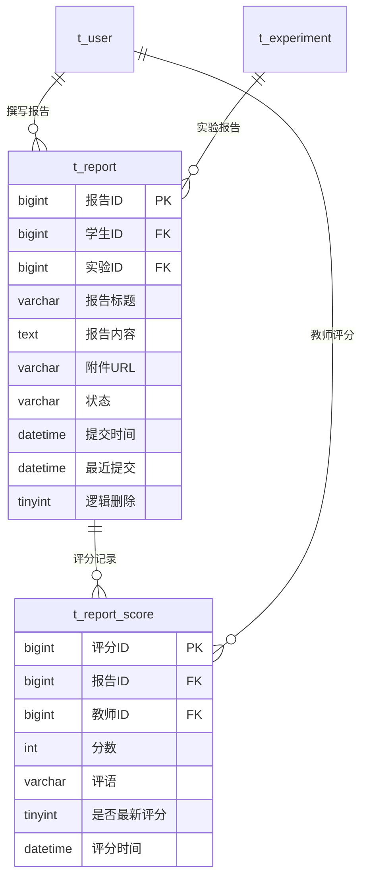
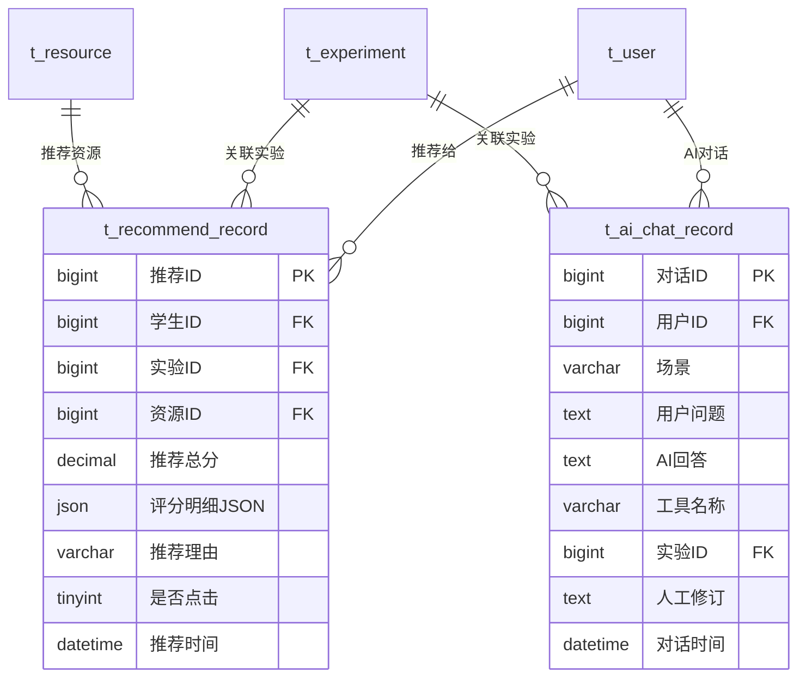

# 油气工程实验教学与安全考核平台 — ER 图

> 共 24 张表，分为 6 个模块。每个模块单独一张 ER 图。

---

## 1. 🔐 用户权限模块（6张表）



| 表 | 说明 |
|----|------|
| `t_user` | 用户账号，密码MD5加密，status=1启用 |
| `t_role` | 角色：ADMIN / TEACHER / STUDENT / LAB_ADMIN |
| `t_permission` | 权限：type=1菜单 type=2按钮，parent_id构建树 |
| `t_user_role` | 用户↔角色 多对多 |
| `t_role_permission` | 角色↔权限 多对多 |
| `t_token` | 登录Token，UUID去横线，默认1天过期 |

---

## 2. 📚 实验教学模块（7张表）



| 表 | 说明 |
|----|------|
| `t_lab_course` | 实验课程，teacher_id关联授课教师 |
| `t_course_student` | 学生选课关系表 |
| `t_experiment` | 实验项目，risk_level: LOW/MEDIUM/HIGH |
| `t_experiment_step` | 实验操作步骤，含安全提示 |
| `t_resource` | 教学资源(DOCUMENT/VIDEO)，view_count累计点击 |
| `t_safety_knowledge` | 安全知识库，可按实验/步骤关联 |
| `t_learning_record` | 学生学习进度追踪，progress 0-100 |

---

## 3. 📝 考试模块（5张表）



| 表 | 说明 |
|----|------|
| `t_question` | 题库：SINGLE/MULTIPLE/JUDGE/SHORT |
| `t_exam_paper` | 试卷：DRAFT→PUBLISHED→CLOSED |
| `t_exam_paper_question` | 试卷↔题目 多对多，含每题分值 |
| `t_exam_record` | 考试记录：IN_PROGRESS→SUBMITTED→GRADED |
| `t_exam_answer` | 每道题的作答详情 |

---

## 4. 📅 预约模块（2张表）



| 表 | 说明 |
|----|------|
| `t_lab_time_slot` | 实验室开放时段，booked_count随预约更新 |
| `t_reservation` | 预约记录：PENDING→APPROVED/REJECTED/CANCELLED |

---

## 5. 📄 报告模块（2张表）



| 表 | 说明 |
|----|------|
| `t_report` | 实验报告：DRAFT→SUBMITTED→GRADED |
| `t_report_score` | 多次评分保留历史，is_latest=1为最新 |

---

## 6. 🤖 推荐与AI模块（2张表）



| 表 | 说明 |
|----|------|
| `t_recommend_record` | 资源推荐记录，score_breakdown存各维度评分 |
| `t_ai_chat_record` | AI问答记录，scene: SAFETY_QA / ERROR_EXPLAIN / REPORT_SUGGEST |

---

## 模块关系总览

```
 t_user ────→ t_user_role ←──── t_role ────→ t_role_permission ←──── t_permission
   │  │                                          
   │  └──→ t_token (登录)                          
   │                                               
   ├──→ t_lab_course ──→ t_experiment ──→ t_experiment_step
   │        │                 │
   │        │                 ├──→ t_resource ←── t_learning_record ── t_user
   │        │                 ├──→ t_safety_knowledge
   │        │                 ├──→ t_exam_paper ──→ t_question ──→ t_exam_record
   │        │                 ├──→ t_lab_time_slot ──→ t_reservation
   │        │                 ├──→ t_report ──→ t_report_score
   │        │                 ├──→ t_recommend_record
   │        │                 └──→ t_ai_chat_record
   │        │
   │        └──→ t_course_student ←── t_user (选课)
   │
   └──→ (所有表的 student_id / teacher_id / create_by 都指向 t_user)
```
