# OG-ExpSafetyPlatform 数据库 E-R 图

> 基于《系统详细设计说明》43 张数据表，覆盖全部 12 个业务模块。
> 使用 Mermaid ERD 语法，GitHub 原生渲染。

---

## 1. 系统总览（核心实体关系）

```mermaid
erDiagram
    t_user ||--o{ t_user_role : "拥有"
    t_role ||--o{ t_user_role : "被分配"
    t_role ||--o{ t_role_permission : "包含"
    t_permission ||--o{ t_role_permission : "被授予"
    t_user ||--o{ t_token : "持有"
    t_user ||--o{ t_operation_log : "产生"
    t_user ||--o{ t_teacher_certification : "申请"
    t_user ||--o{ t_course_student : "加入"
    t_lab_course ||--o{ t_course_student : "包含"
    t_lab_course ||--o{ t_teaching_class : "下设"
    t_lab_course ||--o{ t_class_invite : "生成"
    t_lab_course ||--o{ t_experiment : "组织"
    t_experiment ||--o{ t_experiment_step : "包含"
    t_experiment ||--o{ t_learning_task : "配置"
    t_experiment ||--o{ t_experiment_admission : "形成"
    t_user ||--o{ t_learning_record : "学习"
    t_user ||--o{ t_step_learning_record : "完成步骤"
    t_experiment_step ||--o{ t_step_learning_record : "被完成"
    t_learning_task ||--o{ t_learning_task_record : "被完成"
    t_user ||--o{ t_learning_task_record : "完成"
    t_question ||--o{ t_exam_paper_question : "被引用"
    t_exam_paper ||--o{ t_exam_paper_question : "组成"
    t_exam_paper ||--o{ t_exam_record : "产生"
    t_user ||--o{ t_exam_record : "参加"
    t_exam_record ||--o{ t_exam_answer : "包含"
    t_question ||--o{ t_exam_answer : "被作答"
    t_experiment_admission ||--o{ t_reservation : "作为前提"
    t_lab_time_slot ||--o{ t_reservation : "占用"
    t_user ||--o{ t_reservation : "预约"
    t_user ||--o{ t_report : "撰写"
    t_experiment ||--o{ t_report_template : "定义"
    t_experiment ||--o{ t_report_rubric_item : "定义"
    t_report ||--o{ t_report_score : "获得"
    t_report_score ||--o{ t_report_score_item : "包含"
    t_report_rubric_item ||--o{ t_report_score_item : "被评分"
    t_lab_course ||--o{ t_discussion_topic : "属于"
    t_user ||--o{ t_discussion_topic : "发布"
    t_discussion_topic ||--o{ t_discussion_reply : "收到"
    t_user ||--o{ t_discussion_reply : "回复"
    t_user ||--o{ t_resource : "创建"
    t_resource ||--o{ t_resource_interaction : "收到"
    t_user ||--o{ t_resource_interaction : "互动"
    t_user ||--o{ t_resource_timeline_note : "记录"
    t_resource ||--o{ t_resource_timeline_note : "被标注"
    t_user ||--o{ t_resource_submission : "投稿"
    t_user ||--o{ t_portal_message : "接收"
    t_user ||--o{ t_recent_visit : "记录"
    t_user ||--o{ t_user_shortcut : "配置"
    t_user ||--o{ t_ai_chat_record : "提问"
    t_user ||--o{ t_recommend_record : "获得推荐"
    t_resource ||--o{ t_recommend_record : "被推荐"

    t_user {
        bigint id PK "用户ID"
        varchar username UK "学号/工号"
        varchar password "MD5密码"
        varchar real_name "真实姓名"
        varchar phone "手机号"
        int status "1=启用 0=禁用"
        datetime create_time
        datetime update_time
    }

    t_role {
        bigint id PK "角色ID"
        varchar role_name "角色名称"
        varchar role_code UK "角色编码"
        varchar description "角色描述"
    }

    t_user_role {
        bigint user_id PK,FK "用户ID"
        bigint role_id PK,FK "角色ID"
    }

    t_permission {
        bigint id PK "权限ID"
        varchar perm_code UK "权限码"
        varchar perm_name "权限名称"
        bigint parent_id FK "父节点ID"
    }

    t_role_permission {
        bigint role_id PK,FK "角色ID"
        bigint perm_id PK,FK "权限ID"
    }

    t_token {
        bigint id PK
        bigint user_id FK "用户ID"
        varchar token UK "令牌值"
        datetime expire_time "过期时间"
        datetime create_time
    }

    t_lab_course {
        bigint id PK "课堂ID"
        bigint teacher_id FK "教师ID"
        varchar course_name "课程名称"
        varchar description "课程描述"
        varchar status "DRAFT/PUBLISHED/ARCHIVED"
        datetime create_time
    }
```

---

## 2. 用户认证与权限模块（RBAC）

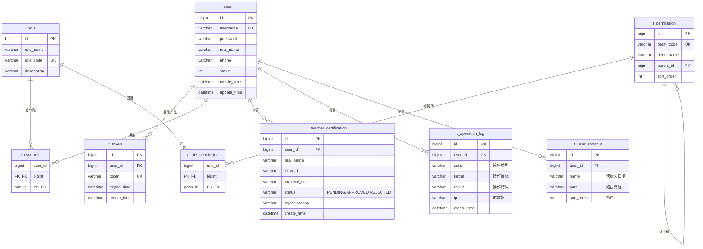

---

## 3. 公共门户与消息模块

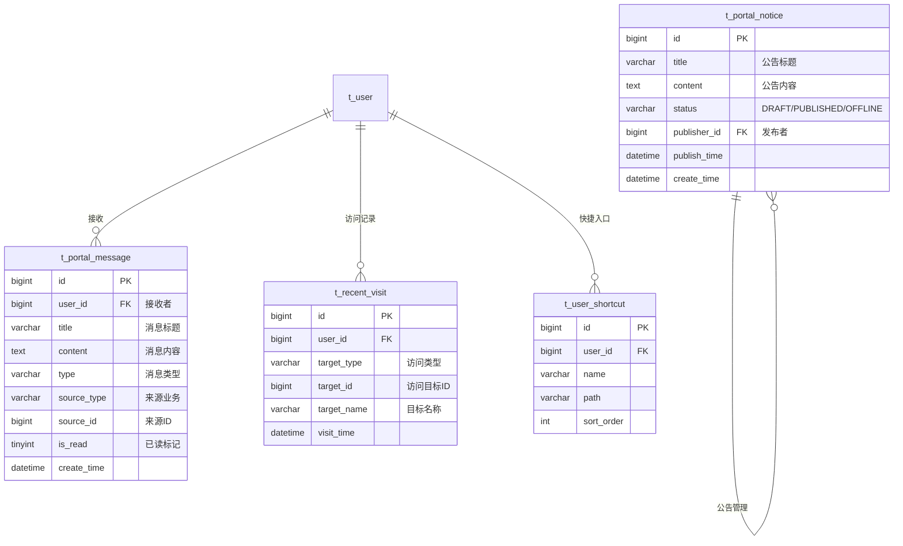

---

## 4. 课堂管理与成员模块

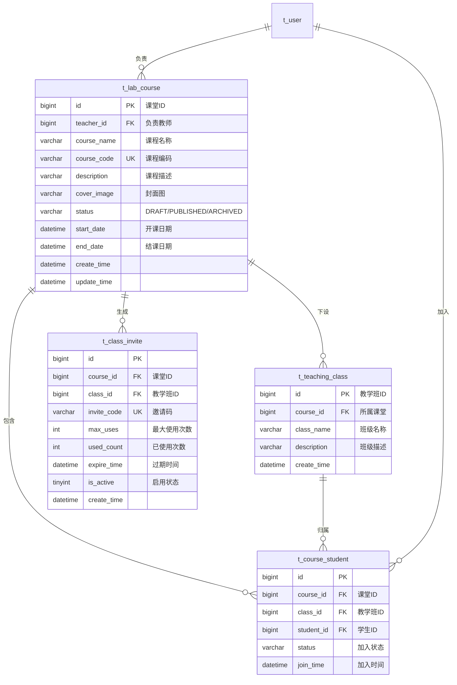

---

## 5. 实验与学习路径模块

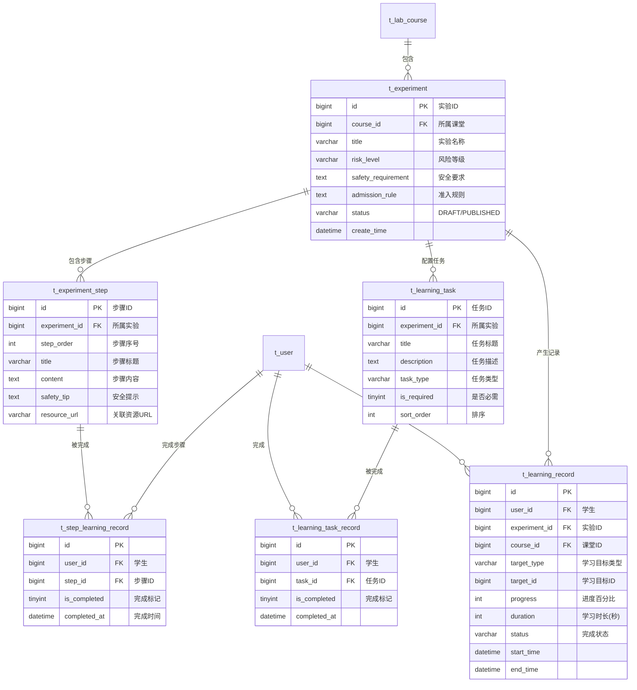

---

## 6. 教学资源与互动模块

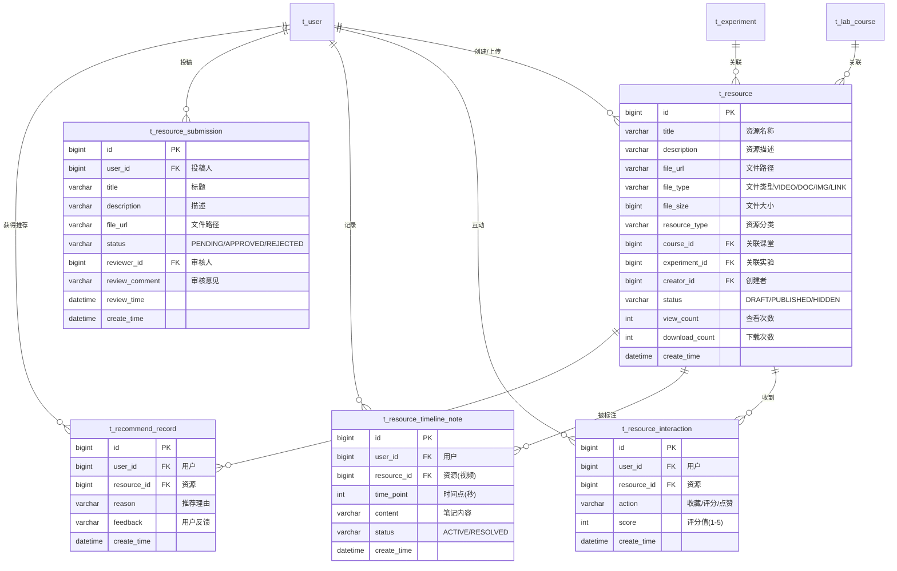

---

## 7. 安全考试模块（题库 + 试卷 + 考试）

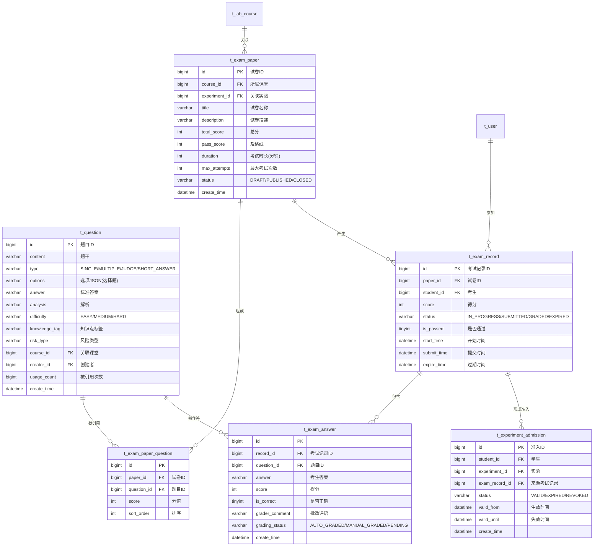

---

## 8. 实验预约模块

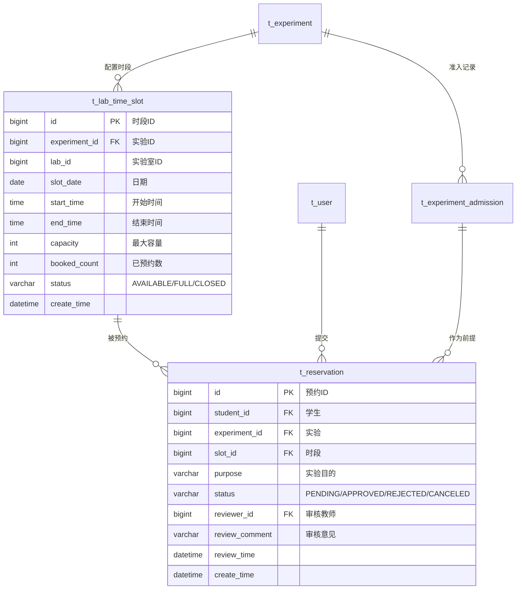

---

## 9. 实验报告与评分模块

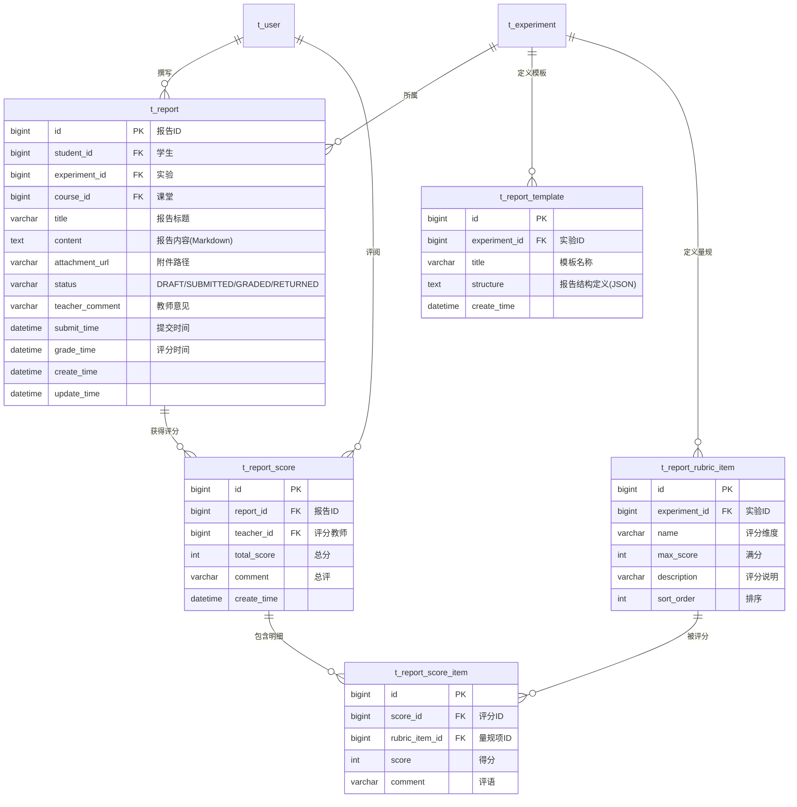

---

## 10. 讨论交流模块

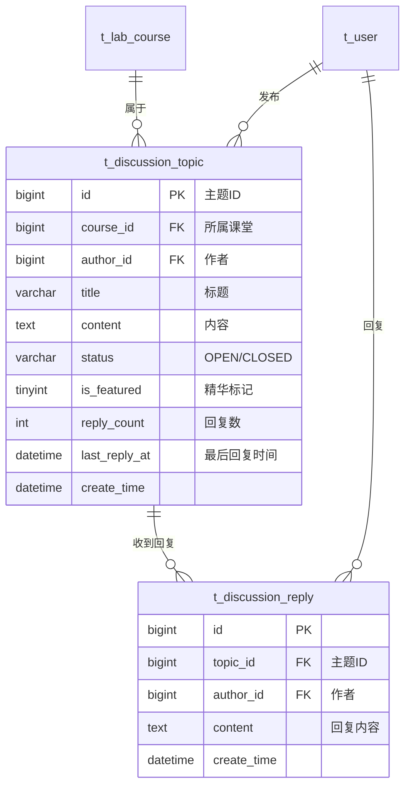

---

## 11. AI 问答模块

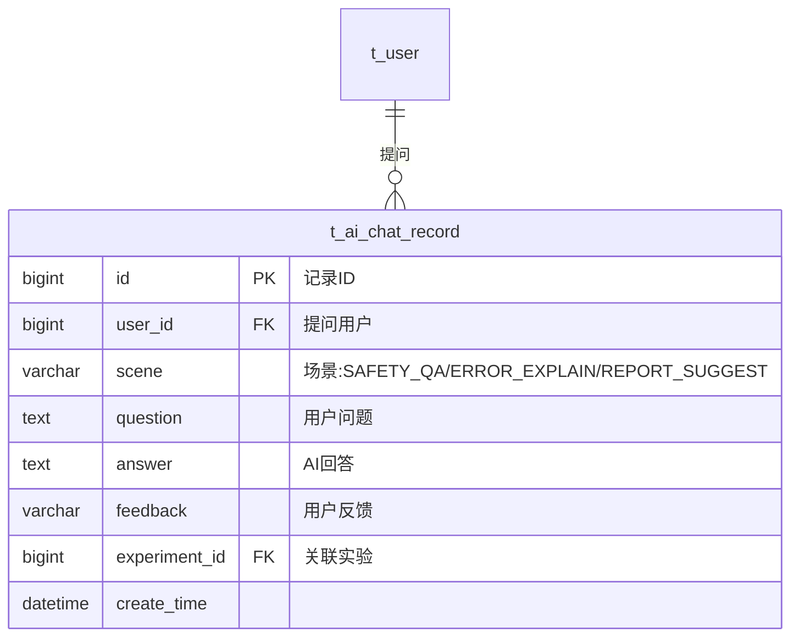

---

## 12. 统计看板模块（跨表聚合读取）

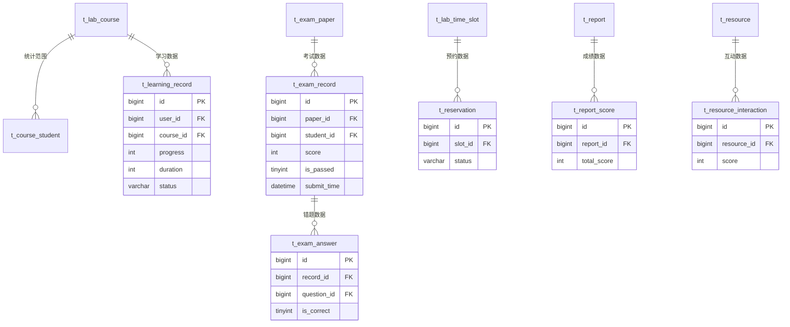

---

## 13. 全系统 43 表汇总

| # | 表名 | 所属模块 | 核心外键 |
|:-:|---|--------|---------|
| 1 | `t_user` | 认证与账户 | — |
| 2 | `t_role` | 角色权限 | — |
| 3 | `t_user_role` | 角色权限 | user_id, role_id |
| 4 | `t_permission` | 角色权限 | parent_id(自引用) |
| 5 | `t_role_permission` | 角色权限 | role_id, perm_id |
| 6 | `t_token` | 认证 | user_id |
| 7 | `t_teacher_certification` | 认证 | user_id |
| 8 | `t_operation_log` | 审计 | user_id |
| 9 | `t_portal_notice` | 门户公告 | publisher_id |
| 10 | `t_portal_message` | 门户消息 | user_id |
| 11 | `t_recent_visit` | 门户 | user_id |
| 12 | `t_user_shortcut` | 门户 | user_id |
| 13 | `t_lab_course` | 课堂管理 | teacher_id |
| 14 | `t_teaching_class` | 课堂管理 | course_id |
| 15 | `t_course_student` | 课堂管理 | course_id, class_id, student_id |
| 16 | `t_class_invite` | 课堂管理 | course_id, class_id |
| 17 | `t_experiment` | 实验 | course_id |
| 18 | `t_experiment_step` | 实验 | experiment_id |
| 19 | `t_step_learning_record` | 学习记录 | user_id, step_id |
| 20 | `t_learning_record` | 学习记录 | user_id, course_id, experiment_id |
| 21 | `t_learning_task` | 学习任务 | experiment_id |
| 22 | `t_learning_task_record` | 学习记录 | user_id, task_id |
| 23 | `t_resource` | 教学资源 | course_id, experiment_id, creator_id |
| 24 | `t_resource_interaction` | 资源互动 | user_id, resource_id |
| 25 | `t_resource_timeline_note` | 资源笔记 | user_id, resource_id |
| 26 | `t_resource_submission` | 资源投稿 | user_id, reviewer_id |
| 27 | `t_recommend_record` | 智能推荐 | user_id, resource_id |
| 28 | `t_question` | 题库 | course_id, creator_id |
| 29 | `t_exam_paper` | 考试 | course_id, experiment_id |
| 30 | `t_exam_paper_question` | 考试 | paper_id, question_id |
| 31 | `t_exam_record` | 考试 | paper_id, student_id |
| 32 | `t_exam_answer` | 考试 | record_id, question_id |
| 33 | `t_experiment_admission` | 实验准入 | student_id, experiment_id, exam_record_id |
| 34 | `t_lab_time_slot` | 实验预约 | experiment_id |
| 35 | `t_reservation` | 实验预约 | student_id, experiment_id, slot_id, reviewer_id |
| 36 | `t_report` | 实验报告 | student_id, experiment_id, course_id |
| 37 | `t_report_template` | 实验报告 | experiment_id |
| 38 | `t_report_rubric_item` | 实验报告 | experiment_id |
| 39 | `t_report_score` | 实验报告 | report_id, teacher_id |
| 40 | `t_report_score_item` | 实验报告 | score_id, rubric_item_id |
| 41 | `t_discussion_topic` | 讨论交流 | course_id, author_id |
| 42 | `t_discussion_reply` | 讨论交流 | topic_id, author_id |
| 43 | `t_ai_chat_record` | AI问答 | user_id, experiment_id |

---

> **说明**：以上 E-R 图使用 Mermaid ERD 语法编写，在 GitHub 上直接渲染为可视化实体关系图。
> 打开 `docs/ER-Diagram.md` 即可在 GitHub 仓库页面查看完整图表。
