# 油气工程实验教学与安全考核平台详细设计说明

> 本说明依据当前仓库中的前端路由与页面、后端控制器/服务/实体以及主数据库脚本整理。文档描述的是 2026-07-11 工作区现状，包括尚未提交但已存在于工作区的考试回看、主观题批改和分步骤学习记录设计。

## 1. 文档目的与设计范围

本文档用于说明系统各业务模块的建设目的、主要需求、实现逻辑和数据依赖，为开发、测试、验收、部署和后续维护提供统一依据。

系统面向游客/普通用户、学生、教师和管理员，形成“资源学习—课堂教学—安全考核—实验准入—实验预约—报告评价”的实验教学闭环，同时提供门户消息、讨论交流、智能推荐、AI 问答和后台治理能力。

### 1.1 当前技术基线

- 前端采用 Vue 3、Vue Router、Pinia、Element Plus 和 Vite，路由元数据保存页面所需角色或权限码。
- 后端采用 Spring Boot、Java、MyBatis-Plus，按 Controller、Service、Mapper、POJO/DTO/VO 分层。
- 前后端通过 `/api/**` REST 接口通信，统一使用 Token 认证和业务结果对象返回数据。
- 主数据库为 MySQL，主 SQL 脚本当前定义 43 张业务表。
- 上传文件保存在后端运行目录的 `uploads` 目录，通过受控接口或 `/uploads/**` 静态映射访问。

### 1.2 总体业务关系

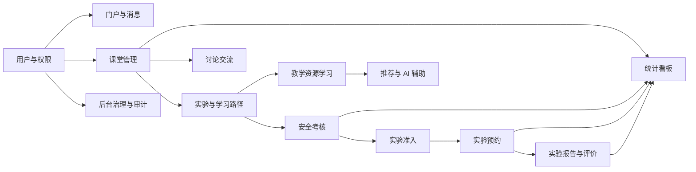
```mermaid
flowchart LR
    U["用户与权限"] --> P["门户与消息"]
    U --> C["课堂管理"]
    C --> E["实验与学习路径"]
    E --> R["教学资源学习"]
    E --> X["安全考核"]
    X --> A["实验准入"]
    A --> B["实验预约"]
    B --> G["实验报告与评价"]
    C --> D["讨论交流"]
    R --> I["推荐与 AI 辅助"]
    C --> S["统计看板"]
    X --> S
    B --> S
    G --> S
    U --> M["后台治理与审计"]
```

主业务链要求前序条件逐步满足：用户必须先取得课堂与资源访问权限，完成必要学习后参加安全考试；考试通过形成实验准入，准入有效时才可预约实验；实验完成后提交报告并由教师按评分规则评价。

## 2. 用户认证、账户与权限模块

### 2.1 模块说明

- **基本描述**：统一管理注册、登录、退出、密码修改、个人资料、用户、角色、权限及教师身份认证。
- **对应需求**：保证所有受保护接口只对已登录用户开放，并依据用户角色和权限码限制不同页面、按钮与业务操作。
- **建设目的与意义**：把身份、角色和业务授权从具体业务模块中分离，避免学生越权执行教师操作、普通用户进入管理员功能或用户访问他人私有数据。
- **主要建设内容**：账号密码校验、Token 签发与失效、个人信息维护、用户增删改查、角色权限配置、教师资格申请与审核。
- **模块特点**：采用 RBAC 模型；前端路由守卫负责页面入口控制，后端 `LoginInterceptor` 负责认证，`PermissionAspect` 对 `@RequirePermission` 接口执行最终授权。
- **核心实现**：`AuthController`、`UserController`、`RoleController`、`PermissionController`、`TeacherCertificationController`、`LoginInterceptor`、`PermissionAspect`。

### 2.2 登录与接口鉴权流程

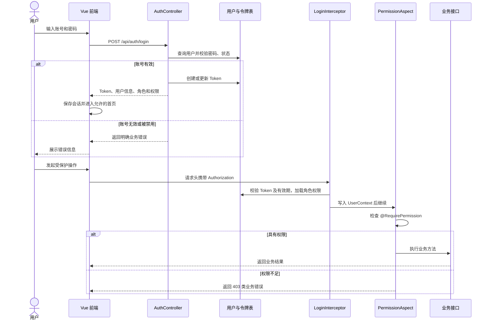
```mermaid
sequenceDiagram
    actor User as 用户
    participant FE as Vue 前端
    participant Auth as AuthController
    participant DB as 用户与令牌表
    participant Interceptor as LoginInterceptor
    participant AOP as PermissionAspect
    participant API as 业务接口

    User->>FE: 输入账号和密码
    FE->>Auth: POST /api/auth/login
    Auth->>DB: 查询用户并校验密码、状态
    alt 账号有效
        Auth->>DB: 创建或更新 Token
        Auth-->>FE: Token、用户信息、角色和权限
        FE->>FE: 保存会话并进入允许的首页
    else 账号无效或被禁用
        Auth-->>FE: 返回明确业务错误
        FE-->>User: 展示错误信息
    end
    User->>FE: 发起受保护操作
    FE->>Interceptor: 请求头携带 Authorization
    Interceptor->>DB: 校验 Token 及有效期，加载角色权限
    Interceptor->>AOP: 写入 UserContext 后继续
    AOP->>AOP: 检查 @RequirePermission
    alt 具有权限
        AOP->>API: 执行业务方法
        API-->>FE: 返回业务结果
    else 权限不足
        AOP-->>FE: 返回 403 类业务错误
    end
```

文字说明：登录和注册是 `/api/**` 下仅有的免登录入口。其他请求必须携带有效 Token；拦截器从令牌反查用户的角色和权限并保存到当前请求上下文。页面权限只改善交互体验，后端权限切面才是安全边界。请求结束后清理线程上下文，避免复用线程时发生用户信息串用。

### 2.3 教师认证流程

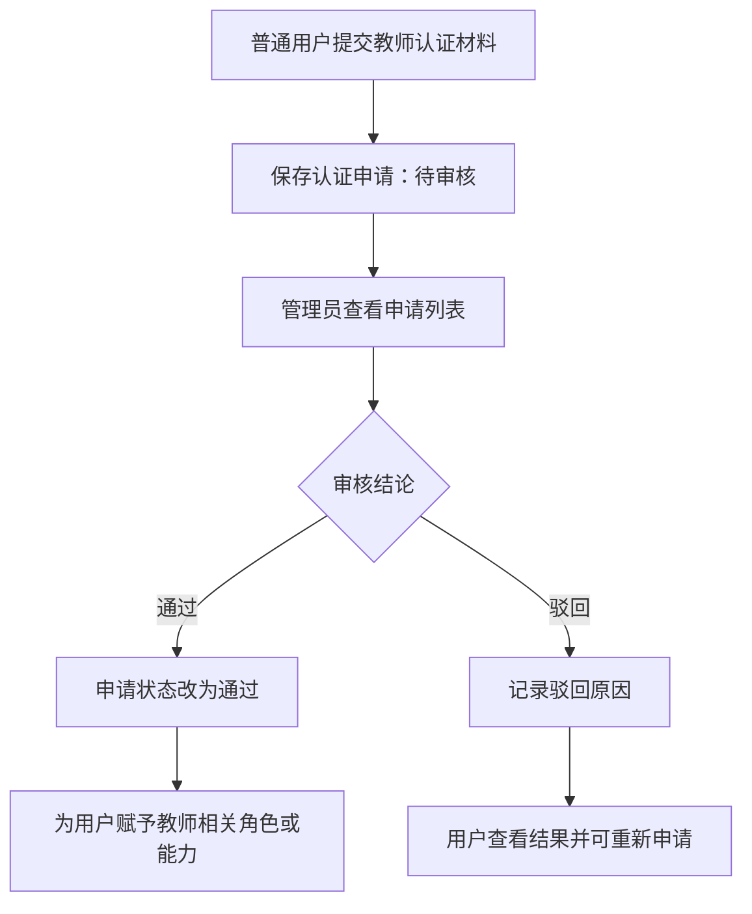
```mermaid
flowchart TD
    A["普通用户提交教师认证材料"] --> B["保存认证申请：待审核"]
    B --> C["管理员查看申请列表"]
    C --> D{"审核结论"}
    D -->|通过| E["申请状态改为通过"]
    E --> F["为用户赋予教师相关角色或能力"]
    D -->|驳回| G["记录驳回原因"]
    G --> H["用户查看结果并可重新申请"]
```

### 2.4 关联数据表

| 数据表 | 作用 | 主要关系 |
|---|---|---|
| `t_user` | 用户账号、密码、基本资料和账号状态 | 与角色、Token、认证申请及各业务记录关联 |
| `t_role` | 角色定义 | 通过 `t_user_role` 关联用户 |
| `t_permission` | 权限码及权限树节点 | 通过 `t_role_permission` 关联角色 |
| `t_user_role` | 用户—角色多对多关系 | 连接用户与角色 |
| `t_role_permission` | 角色—权限多对多关系 | 连接角色与权限 |
| `t_token` | 登录令牌、所属用户和过期时间 | 每次受保护请求用于身份恢复 |
| `t_teacher_certification` | 教师认证材料、审核状态和意见 | 申请人关联 `t_user` |
| `t_operation_log` | 登录、退出及管理操作的审计信息 | 记录操作者、动作、结果和时间 |

## 3. 公共门户、公告与消息日程模块

### 3.1 模块说明

- **基本描述**：向不同身份用户提供统一首页、公告、站内消息、未读数、日历事件、全局搜索、最近访问和快捷入口。
- **对应需求**：用户登录后能够及时看到待办事项、考试/预约/报告提醒和平台公告，并快速返回高频业务页面。
- **建设目的与意义**：将分散在考试、预约、报告等模块的信息聚合，降低用户寻找任务的成本，减少遗漏关键时间节点。
- **主要建设内容**：角色化首页数据组装、公告发布与上下线、消息已读管理、日历聚合、跨模块搜索、访问历史和个人快捷方式配置。
- **模块特点**：门户数据按用户身份动态组装；消息和日历是业务模块的统一出口；管理员可管理公告并手工触发提醒任务。
- **核心实现**：`PortalController`、`AdminPortalController`、`PortalService`、`PortalMessageService`、`PortalReminderService`。

### 3.2 门户聚合流程

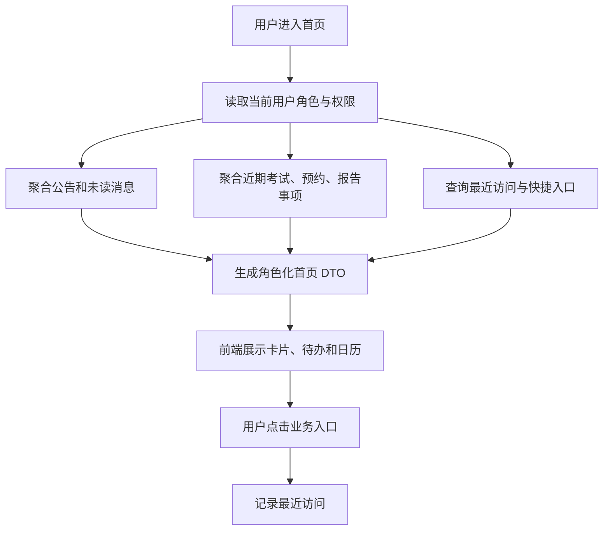
```mermaid
flowchart TD
    A["用户进入首页"] --> B["读取当前用户角色与权限"]
    B --> C["聚合公告和未读消息"]
    B --> D["聚合近期考试、预约、报告事项"]
    B --> E["查询最近访问与快捷入口"]
    C --> F["生成角色化首页 DTO"]
    D --> F
    E --> F
    F --> G["前端展示卡片、待办和日历"]
    G --> H["用户点击业务入口"]
    H --> I["记录最近访问"]
```

文字说明：门户不复制各业务数据，而是从相关服务读取当前用户可见的信息后组装视图对象。提醒服务根据临近的考试、预约或报告节点生成站内消息；用户阅读后只更新个人消息的已读状态，不影响公告本身。

### 3.3 公告状态流程

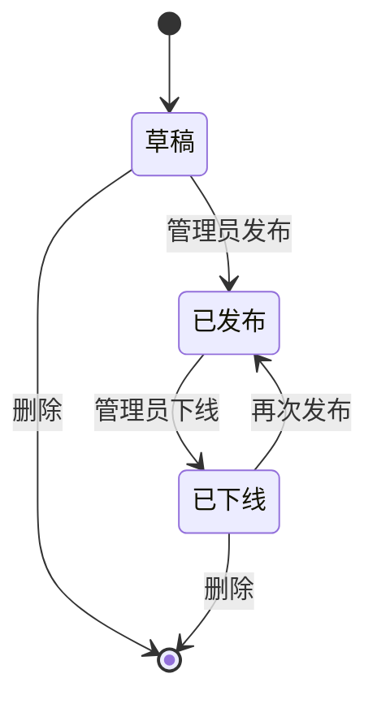
```mermaid
stateDiagram-v2
    [*] --> 草稿
    草稿 --> 已发布: 管理员发布
    已发布 --> 已下线: 管理员下线
    已下线 --> 已发布: 再次发布
    草稿 --> [*]: 删除
    已下线 --> [*]: 删除
```

### 3.4 关联数据表

| 数据表 | 作用 | 主要关系 |
|---|---|---|
| `t_portal_notice` | 公告内容、发布状态、发布时间 | 由管理员维护，供门户读取 |
| `t_portal_message` | 面向具体用户的站内消息和已读状态 | 关联接收用户及业务来源 |
| `t_recent_visit` | 用户最近访问的业务对象或页面 | 关联用户，按时间倒序展示 |
| `t_user_shortcut` | 用户自定义快捷入口和排序 | 关联用户 |
| `t_user` | 门户数据的接收主体 | 决定角色化内容范围 |

## 4. 课堂、教学班与成员管理模块

### 4.1 模块说明

- **基本描述**：教师创建和维护课堂，将实验内容、教学班和学生组织到具体教学空间中；学生可通过导入名单或邀请码加入课堂。
- **对应需求**：支持教师按课程开展分班教学，控制课程发布、归档和成员范围，并为后续学习、考试和统计提供课程上下文。
- **建设目的与意义**：把公共资源与正式教学活动区分开，使实验、任务、考试、讨论和成绩能够按课堂隔离。
- **主要建设内容**：课堂增删改查、发布/归档、课堂复制、教学班维护、学生导入与移除、邀请码生成/停用和学生加入课堂。
- **模块特点**：课堂是教学域聚合根；教师对自己创建或负责的课堂执行管理操作；邀请码可以控制有效期、使用次数和启停状态。
- **核心实现**：`CourseController`、`CourseService`、`ClassInviteService`、`CourseList.vue`、`CourseManagement.vue`、`CourseEditor.vue`。

### 4.2 课堂建设与加入流程

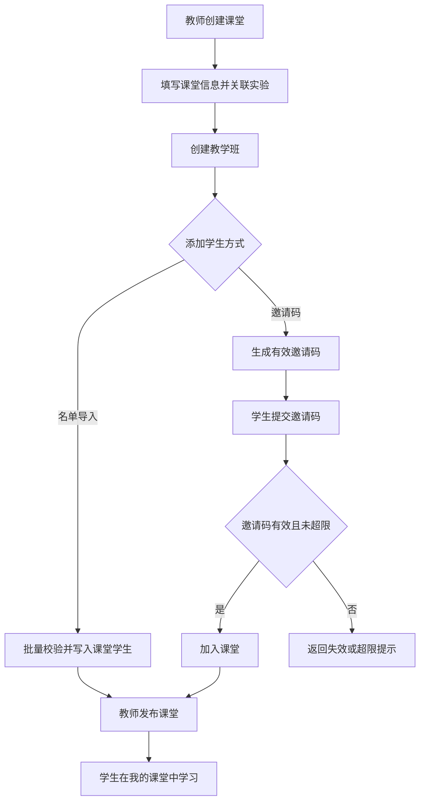
```mermaid
flowchart TD
    A["教师创建课堂"] --> B["填写课堂信息并关联实验"]
    B --> C["创建教学班"]
    C --> D{"添加学生方式"}
    D -->|名单导入| E["批量校验并写入课堂学生"]
    D -->|邀请码| F["生成有效邀请码"]
    F --> G["学生提交邀请码"]
    G --> H{"邀请码有效且未超限"}
    H -->|是| I["加入课堂"]
    H -->|否| J["返回失效或超限提示"]
    E --> K["教师发布课堂"]
    I --> K
    K --> L["学生在我的课堂中学习"]
```

文字说明：课堂创建后可先处于编辑状态，教师配置教学班、实验内容和学生范围后再发布。名单导入与邀请码最终都写入课堂学生关系表，因而下游学习路径和考试可采用一致的课堂成员校验。

### 4.3 关联数据表

| 数据表 | 作用 | 主要关系 |
|---|---|---|
| `t_lab_course` | 课堂/课程主体、教师、状态及教学信息 | 关联实验、教学班、学生、试卷等业务 |
| `t_teaching_class` | 课堂下的教学班 | 从属于课堂 |
| `t_course_student` | 课堂学生成员关系 | 连接课堂、教学班和学生 |
| `t_class_invite` | 邀请码、有效期、使用限制和状态 | 从属于课堂或教学班 |
| `t_user` | 教师与学生主体 | 通过负责人或成员关系关联课堂 |
| `t_experiment` | 课堂所组织的实验内容 | 通过课程标识归属课堂 |

## 5. 实验内容、步骤与学习任务模块

### 5.1 模块说明

- **基本描述**：教师维护实验目标、风险、安全要求、准入条件和分步骤操作内容，学生按照课堂学习路径完成章节、步骤和任务。
- **对应需求**：把实验前知识学习、风险辨识和操作准备结构化，能够追踪学生学习进度，而不是仅提供文件下载。
- **建设目的与意义**：通过可检查的前置学习和任务确认提高实验安全性，为考试准入和教师统计提供过程证据。
- **主要建设内容**：实验增删改查、状态维护、实验步骤编辑、学习任务配置、检查清单确认、任务完成分布和学习进度记录。
- **模块特点**：实验由有序步骤组成；任务可形成路径节点；当前工作区新增 `t_step_learning_record`，用于精确记录每个实验步骤是否完成。
- **核心实现**：`ExperimentController`、`LearningTaskController`、`LearningRecordController`、`ExperimentService`、`LearningTaskService`、`StepLearningRecordService`。

### 5.2 学习路径活动图

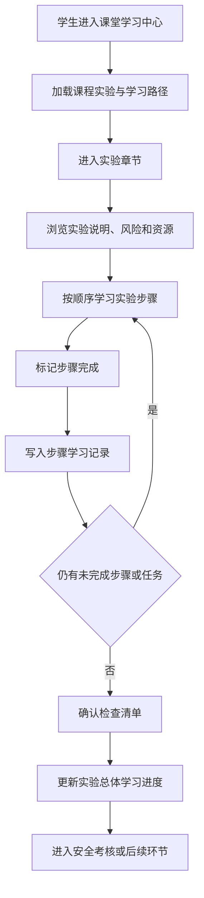
```mermaid
flowchart TD
    A["学生进入课堂学习中心"] --> B["加载课程实验与学习路径"]
    B --> C["进入实验章节"]
    C --> D["浏览实验说明、风险和资源"]
    D --> E["按顺序学习实验步骤"]
    E --> F["标记步骤完成"]
    F --> G["写入步骤学习记录"]
    G --> H{"仍有未完成步骤或任务"}
    H -->|是| E
    H -->|否| I["确认检查清单"]
    I --> J["更新实验总体学习进度"]
    J --> K["进入安全考核或后续环节"]
```

文字说明：页面先读取实验概览和学习路径，再按步骤展示文字、资源和安全提示。完成步骤时接口使用“用户 + 步骤”定位记录，避免重复写入；总体进度由步骤和任务完成情况计算或更新。检查清单用于确认学生已理解关键注意事项，但不能替代安全考试准入。

### 5.3 关联数据表

| 数据表 | 作用 | 主要关系 |
|---|---|---|
| `t_experiment` | 实验基本信息、风险等级、安全要求、准入规则 | 关联课堂、步骤、资源、考试、预约与报告 |
| `t_experiment_step` | 实验步骤内容、顺序和操作说明 | 从属于实验 |
| `t_step_learning_record` | 用户对单个步骤的完成记录 | 连接用户、实验步骤，支持细粒度进度 |
| `t_learning_record` | 用户对资源/实验的总体进度、时长和完成状态 | 连接用户、资源或实验 |
| `t_learning_task` | 实验学习任务及检查清单要求 | 从属于实验 |
| `t_learning_task_record` | 学生任务完成和确认记录 | 连接任务与用户 |
| `t_lab_course` | 实验所属课堂上下文 | 与实验关联 |

## 6. 教学资源学习、互动与投稿模块

### 6.1 模块说明

- **基本描述**：统一管理视频、文档、图片、链接等教学资源，支持检索、预览、学习、互动、时间轴笔记、统计和用户投稿审核。
- **对应需求**：学生既能从课堂实验进入定向资源，也能在公共资源中心自主学习；教师能够建设资源，管理员能够审核公开投稿。
- **建设目的与意义**：沉淀可复用的油气工程实验知识与安全教育内容，并通过学习行为数据发现资源质量和教学难点。
- **主要建设内容**：资源上传与元数据维护、状态控制、查看/下载统计、评分收藏等互动、视频时间轴笔记、实验热点统计、投稿及审核、公开资源预览。
- **模块特点**：资源可关联课程、实验、知识点和风险类型；文件访问经过资源权限判断；时间轴笔记适用于视频定位和问题追踪。
- **核心实现**：`ResourceController`、`FileController`、`ResourceSubmissionController`、`ResourceService`、`ResourceTimelineNoteService`。

### 6.2 资源发布与学习流程

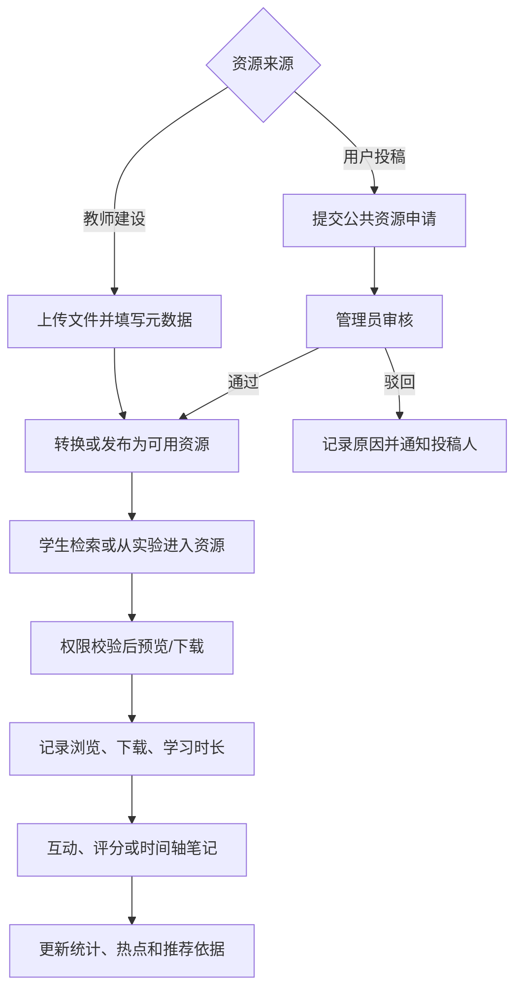
```mermaid
flowchart TD
    A{"资源来源"} -->|教师建设| B["上传文件并填写元数据"]
    A -->|用户投稿| C["提交公共资源申请"]
    C --> D["管理员审核"]
    D -->|通过| E["转换或发布为可用资源"]
    D -->|驳回| F["记录原因并通知投稿人"]
    B --> E
    E --> G["学生检索或从实验进入资源"]
    G --> H["权限校验后预览/下载"]
    H --> I["记录浏览、下载、学习时长"]
    I --> J["互动、评分或时间轴笔记"]
    J --> K["更新统计、热点和推荐依据"]
```

文字说明：资源元数据与物理文件分开管理。预览和下载前需检查资源状态及当前用户的可见范围；查看、下载和互动分别形成统计数据。用户投稿先进入独立审核表，只有审核通过后才能作为公共资源对外展示。

### 6.3 关联数据表

| 数据表 | 作用 | 主要关系 |
|---|---|---|
| `t_resource` | 资源元数据、文件位置、类型、状态和统计字段 | 可关联课程、实验及创建者 |
| `t_learning_record` | 资源学习进度、时长与完成情况 | 连接资源和学习用户 |
| `t_resource_interaction` | 收藏、评分等资源互动 | 连接用户和资源 |
| `t_resource_timeline_note` | 视频时间点笔记、问题和状态 | 连接用户、资源和时间点 |
| `t_resource_submission` | 公共资源投稿内容与审核结果 | 连接投稿人和审核人 |
| `t_recommend_record` | 推荐结果、原因及用户反馈 | 连接用户和被推荐资源 |
| `t_experiment` | 资源的实验业务上下文 | 与资源关联 |

## 7. 题库、试卷与安全考试模块

### 7.1 模块说明

- **基本描述**：教师维护安全题库，按课程和实验创建试卷、配置题目及考试规则；学生在线答题，系统保存答案、客观题判分并支持主观题人工批改和考试回看。
- **对应需求**：通过安全知识考核验证学生是否理解实验风险与操作规范，并把考试结果作为实验准入的重要依据。
- **建设目的与意义**：让安全培训从“已浏览”转为“可验证掌握”，保留完整答题证据，支持错题复习和教学分析。
- **主要建设内容**：题库增删改查与批量创建、试卷创建/编辑/删除/发布、题目分值和顺序、智能组卷、考试开始/暂存/提交、自动判分、主观题批改、记录回看、错题与统计分析。
- **模块特点**：试卷和题目采用中间表解耦；考试过程中允许答案暂存；客观题提交时自动判定，包含简答题时可进入待批改状态；按试卷规则计算总分和是否通过。
- **核心实现**：`QuestionController`、`ExamPaperController`、`ExamController`、`ExamStatisticsController`、`QuestionService`、`ExamPaperService`、`ExamService`。

### 7.2 组卷流程

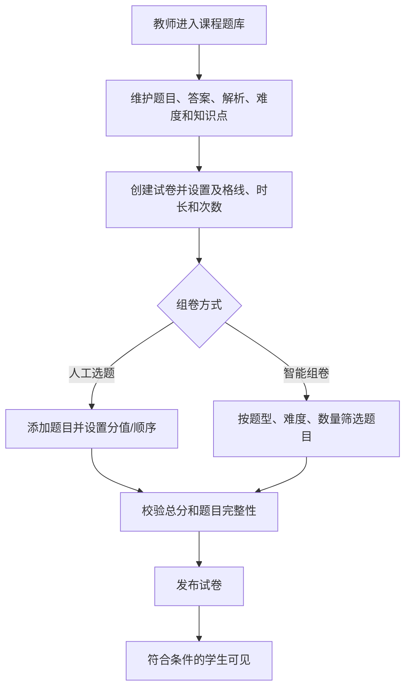
```mermaid
flowchart TD
    A["教师进入课程题库"] --> B["维护题目、答案、解析、难度和知识点"]
    B --> C["创建试卷并设置及格线、时长和次数"]
    C --> D{"组卷方式"}
    D -->|人工选题| E["添加题目并设置分值/顺序"]
    D -->|智能组卷| F["按题型、难度、数量筛选题目"]
    E --> G["校验总分和题目完整性"]
    F --> G
    G --> H["发布试卷"]
    H --> I["符合条件的学生可见"]
```

### 7.3 考试与批改时序图

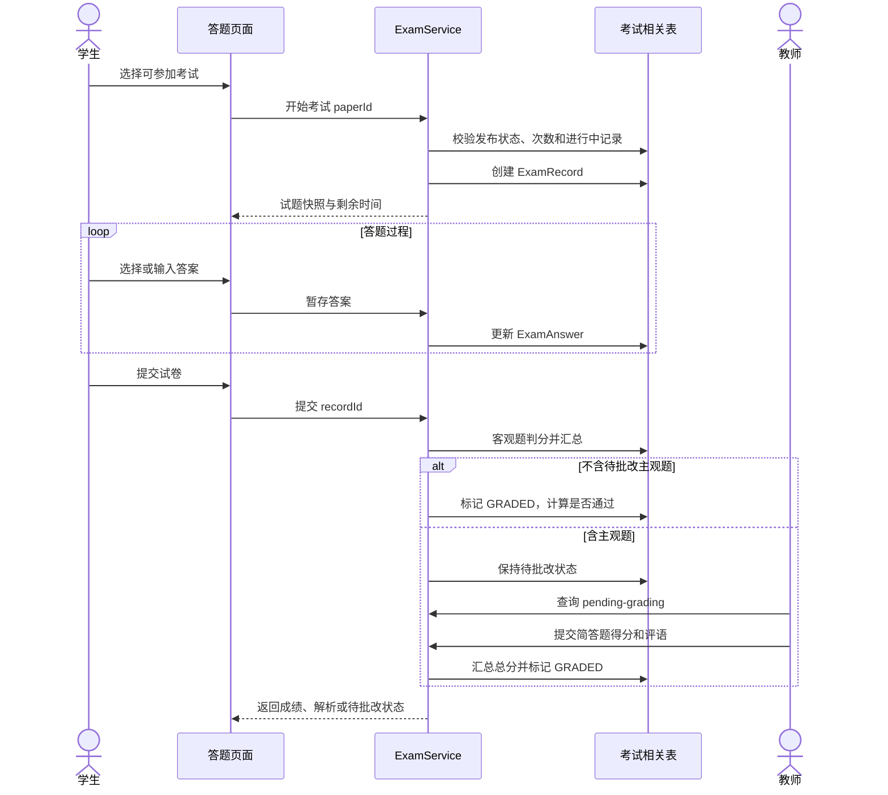
```mermaid
sequenceDiagram
    actor S as 学生
    participant FE as 答题页面
    participant Exam as ExamService
    participant DB as 考试相关表
    actor T as 教师

    S->>FE: 选择可参加考试
    FE->>Exam: 开始考试 paperId
    Exam->>DB: 校验发布状态、次数和进行中记录
    Exam->>DB: 创建 ExamRecord
    Exam-->>FE: 试题快照与剩余时间
    loop 答题过程
        S->>FE: 选择或输入答案
        FE->>Exam: 暂存答案
        Exam->>DB: 更新 ExamAnswer
    end
    S->>FE: 提交试卷
    FE->>Exam: 提交 recordId
    Exam->>DB: 客观题判分并汇总
    alt 不含待批改主观题
        Exam->>DB: 标记 GRADED，计算是否通过
    else 含主观题
        Exam->>DB: 保持待批改状态
        T->>Exam: 查询 pending-grading
        T->>Exam: 提交简答题得分和评语
        Exam->>DB: 汇总总分并标记 GRADED
    end
    Exam-->>FE: 返回成绩、解析或待批改状态
```

文字说明：开始考试时创建一次考试记录，后续暂存和提交都以记录 ID 为边界，防止串改其他考生数据。试题展示不应泄露标准答案；提交后按考试规则决定答案解析是否可见。教师批改必须校验试卷/课程管理范围，并在全部主观题有分后重新汇总成绩。

### 7.4 考试记录状态

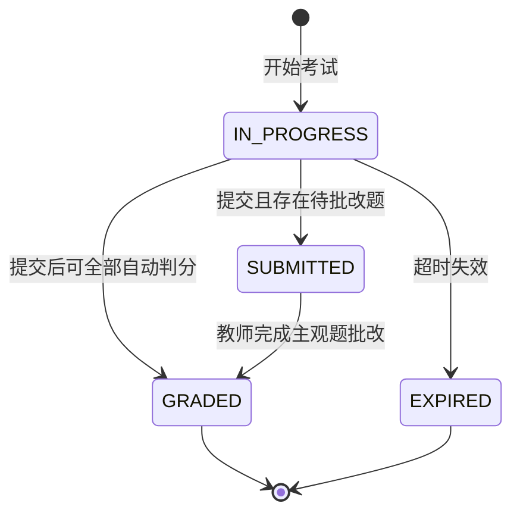
```mermaid
stateDiagram-v2
    [*] --> IN_PROGRESS: 开始考试
    IN_PROGRESS --> SUBMITTED: 提交且存在待批改题
    IN_PROGRESS --> GRADED: 提交后可全部自动判分
    IN_PROGRESS --> EXPIRED: 超时失效
    SUBMITTED --> GRADED: 教师完成主观题批改
    GRADED --> [*]
    EXPIRED --> [*]
```

### 7.5 关联数据表

| 数据表 | 作用 | 主要关系 |
|---|---|---|
| `t_question` | 题干、题型、选项、答案、解析、难度、知识点和风险类型 | 被试卷引用 |
| `t_exam_paper` | 试卷名称、课程/实验、时长、及格线、次数和状态 | 关联题目和考试记录 |
| `t_exam_paper_question` | 试卷题目、分值及排序 | 连接试卷与题目 |
| `t_exam_record` | 单次考试的考生、开始/提交时间、分数、状态和通过结果 | 关联试卷、学生和答案 |
| `t_exam_answer` | 每题作答、得分、正确性和批改信息 | 关联考试记录和题目 |
| `t_experiment_admission` | 考试通过后形成的实验准入凭证 | 关联学生、实验及来源考试记录 |
| `t_lab_course` | 考试所属课堂 | 约束可见学生范围 |

## 8. 实验准入与预约模块

### 8.1 模块说明

- **基本描述**：根据安全考试结果形成实验准入资格；教师维护实验室开放时段和容量，学生在准入有效的前提下提交预约，教师审核预约。
- **对应需求**：保证只有完成安全要求的学生才能预约实验，并对实验室时段容量和申请状态进行统一控制。
- **建设目的与意义**：把考试结果和线下实验安排连接起来，降低无资格预约、超容量预约和时间冲突风险。
- **主要建设内容**：准入状态查询、实验时段维护、可预约时段查询、预约提交、我的预约、取消预约、待审核列表和审核处理。
- **模块特点**：预约创建需同时校验身份、准入、时段状态、容量、重复预约和时间条件；审核和取消会影响已预约数量，必须保持状态与容量一致。
- **核心实现**：`AdmissionService`、`ReservationController`、`ReservationService`、`LabTimeSlot`、`Reservation`。

### 8.2 准入与预约流程

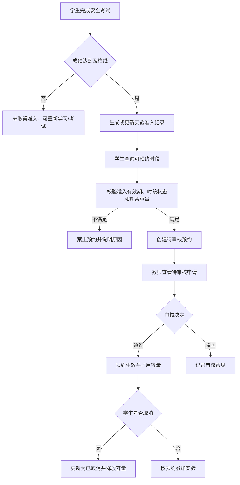
```mermaid
flowchart TD
    A["学生完成安全考试"] --> B{"成绩达到及格线"}
    B -->|否| C["未取得准入，可重新学习/考试"]
    B -->|是| D["生成或更新实验准入记录"]
    D --> E["学生查询可预约时段"]
    E --> F["校验准入有效期、时段状态和剩余容量"]
    F -->|不满足| G["禁止预约并说明原因"]
    F -->|满足| H["创建待审核预约"]
    H --> I["教师查看待审核申请"]
    I --> J{"审核决定"}
    J -->|通过| K["预约生效并占用容量"]
    J -->|驳回| L["记录审核意见"]
    K --> M{"学生是否取消"}
    M -->|是| N["更新为已取消并释放容量"]
    M -->|否| O["按预约参加实验"]
```

文字说明：`t_experiment_admission` 是考试与预约之间的业务凭证。可预约时段查询只能作为界面提示，提交预约时仍需在后端重新校验，避免多人并发看到同一剩余名额后超额预约。教师待审核接口返回面向页面的 VO，包含学生姓名、实验室、日期和时间范围。

### 8.3 预约状态

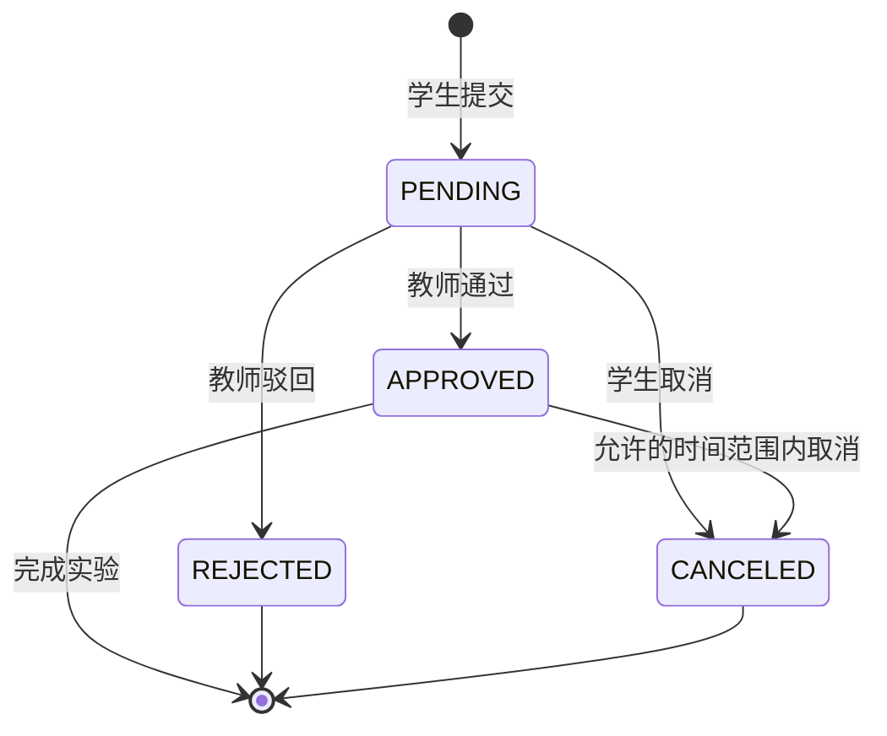
```mermaid
stateDiagram-v2
    [*] --> PENDING: 学生提交
    PENDING --> APPROVED: 教师通过
    PENDING --> REJECTED: 教师驳回
    PENDING --> CANCELED: 学生取消
    APPROVED --> CANCELED: 允许的时间范围内取消
    APPROVED --> [*]: 完成实验
    REJECTED --> [*]
    CANCELED --> [*]
```

### 8.4 关联数据表

| 数据表 | 作用 | 主要关系 |
|---|---|---|
| `t_experiment_admission` | 学生实验准入状态、来源成绩和有效期 | 连接学生、实验和考试记录 |
| `t_lab_time_slot` | 实验日期、时间段、容量、已预约量和状态 | 关联实验或实验室 |
| `t_reservation` | 预约申请、学生、实验、时段、状态和审核意见 | 关联学生和时段 |
| `t_exam_record` | 准入的考试成绩来源 | 与准入记录关联 |
| `t_experiment` | 被预约实验及准入规则 | 关联时段与准入 |
| `t_user` | 预约学生和审核教师 | 分别作为申请人与审核人 |

## 9. 实验报告、模板与评分模块

### 9.1 模块说明

- **基本描述**：学生按实验报告模板保存草稿和提交报告，教师查看待评报告，按总分或评分量规逐项打分，可退回修改。
- **对应需求**：记录实验成果和分析过程，规范不同实验的报告结构及评分标准，使成绩可解释、可追溯。
- **建设目的与意义**：完成教学闭环，将实验过程转化为可评价学习成果，并通过量规减少评分随意性。
- **主要建设内容**：报告新建/修改/提交、我的报告、报告详情、实验模板和评分量规读取、教师待评列表、总评、逐项评分、退回修改、模板与量规维护。
- **模块特点**：报告保存与正式提交分离；量规定义和实际评分明细分离；教师只能评阅其管理范围内的报告；退回时保留修改意见和历史状态。
- **核心实现**：`ReportController`、`ReportService`、`ReportRubricService`、`Report.vue` 相关路由页面。

### 9.2 报告提交与评分时序图

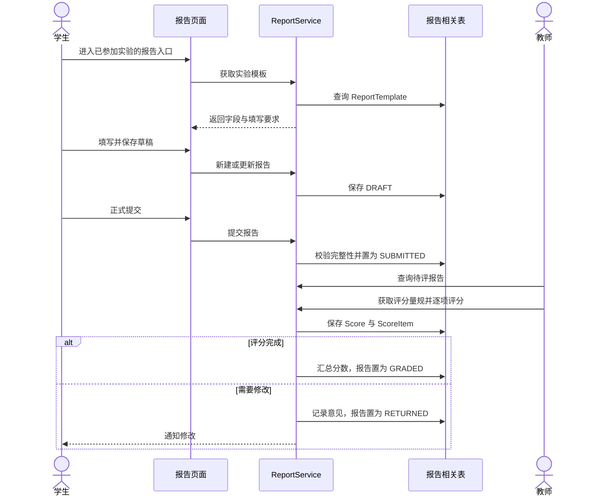
```mermaid
sequenceDiagram
    actor S as 学生
    participant FE as 报告页面
    participant Report as ReportService
    participant DB as 报告相关表
    actor T as 教师

    S->>FE: 进入已参加实验的报告入口
    FE->>Report: 获取实验模板
    Report->>DB: 查询 ReportTemplate
    Report-->>FE: 返回字段与填写要求
    S->>FE: 填写并保存草稿
    FE->>Report: 新建或更新报告
    Report->>DB: 保存 DRAFT
    S->>FE: 正式提交
    FE->>Report: 提交报告
    Report->>DB: 校验完整性并置为 SUBMITTED
    T->>Report: 查询待评报告
    T->>Report: 获取评分量规并逐项评分
    Report->>DB: 保存 Score 与 ScoreItem
    alt 评分完成
        Report->>DB: 汇总分数，报告置为 GRADED
    else 需要修改
        Report->>DB: 记录意见，报告置为 RETURNED
        Report-->>S: 通知修改
    end
```

### 9.3 报告状态

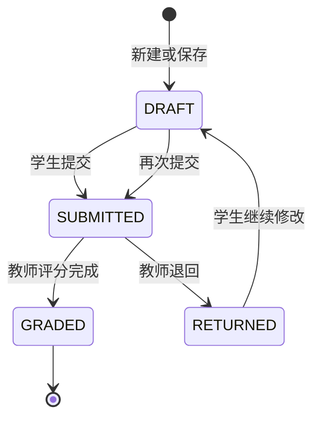
```mermaid
stateDiagram-v2
    [*] --> DRAFT: 新建或保存
    DRAFT --> SUBMITTED: 学生提交
    SUBMITTED --> GRADED: 教师评分完成
    SUBMITTED --> RETURNED: 教师退回
    RETURNED --> DRAFT: 学生继续修改
    DRAFT --> SUBMITTED: 再次提交
    GRADED --> [*]
```

### 9.4 关联数据表

| 数据表 | 作用 | 主要关系 |
|---|---|---|
| `t_report` | 报告内容、附件、状态、提交时间和教师意见 | 连接学生、实验和预约/课程上下文 |
| `t_report_template` | 某实验的报告结构和填写要求 | 从属于实验 |
| `t_report_rubric_item` | 评分维度、分值、说明和排序 | 从属于实验评分量规 |
| `t_report_score` | 一次报告评分的总分和总评 | 关联报告与评分教师 |
| `t_report_score_item` | 每个量规项的得分和评语 | 连接总评分与量规项 |
| `t_experiment` | 模板、量规和报告所属实验 | 业务聚合关系 |
| `t_user` | 报告学生和评分教师 | 作为作者与评阅人 |

## 10. 讨论交流模块

### 10.1 模块说明

- **基本描述**：课堂成员围绕课程、实验和学习问题发布主题、查看详情并回复，教师可关闭主题或设置精华。
- **对应需求**：支持学生提出实验预习和安全知识问题，教师集中答疑，并沉淀可复用讨论内容。
- **建设目的与意义**：补足单向资源学习的交流环节，及时发现共性困难和错误理解。
- **主要建设内容**：主题分页查询、主题详情、发布主题、回复、状态管理和精华管理。
- **模块特点**：讨论内容以课堂可见范围隔离；普通成员负责发布和回复，具有课堂管理权限的教师负责治理。
- **核心实现**：`DiscussionController`、`DiscussionService`、`DiscussionCenter.vue`。

### 10.2 讨论流程

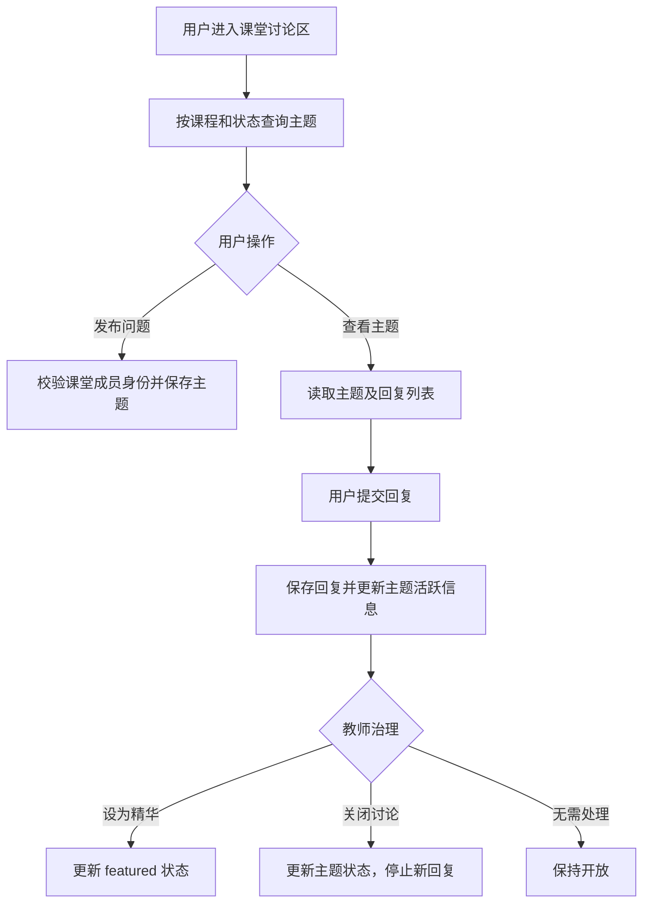
```mermaid
flowchart TD
    A["用户进入课堂讨论区"] --> B["按课程和状态查询主题"]
    B --> C{"用户操作"}
    C -->|发布问题| D["校验课堂成员身份并保存主题"]
    C -->|查看主题| E["读取主题及回复列表"]
    E --> F["用户提交回复"]
    F --> G["保存回复并更新主题活跃信息"]
    G --> H{"教师治理"}
    H -->|设为精华| I["更新 featured 状态"]
    H -->|关闭讨论| J["更新主题状态，停止新回复"]
    H -->|无需处理| K["保持开放"]
```

### 10.3 关联数据表

| 数据表 | 作用 | 主要关系 |
|---|---|---|
| `t_discussion_topic` | 主题标题、内容、作者、课程、状态和精华标记 | 关联课堂与发帖用户 |
| `t_discussion_reply` | 回复内容、作者和时间 | 从属于讨论主题 |
| `t_lab_course` | 讨论可见范围 | 与主题关联 |
| `t_course_student` | 判断学生是否为课堂成员 | 连接课堂和学生 |
| `t_user` | 主题和回复作者 | 与两类内容关联 |

## 11. 智能推荐与 AI 问答模块

### 11.1 模块说明

- **基本描述**：依据用户学习行为和资源属性推荐学习资源，并提供面向实验教学与安全知识的 AI 问答、历史记录和反馈。
- **对应需求**：帮助用户快速找到与当前课程、实验、知识点或薄弱项相关的内容，并通过对话获得辅助解释。
- **建设目的与意义**：降低资源检索成本，为个性化学习和常见问题解答提供辅助能力，但不替代教师判断和正式安全规范。
- **主要建设内容**：资源推荐列表、推荐触发与记录、AI 提问、对话历史、回答反馈。
- **模块特点**：推荐和 AI 均受权限控制；推荐结果可追溯原因；AI 记录保留问题、回答和用户反馈，便于质量评估。
- **核心实现**：`RecommendController`、`AiController`、`RecommendService`、`AiChatService`。

### 11.2 推荐与问答流程

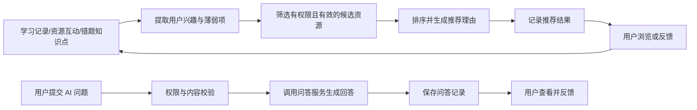
```mermaid
flowchart LR
    A["学习记录/资源互动/错题知识点"] --> B["提取用户兴趣与薄弱项"]
    B --> C["筛选有权限且有效的候选资源"]
    C --> D["排序并生成推荐理由"]
    D --> E["记录推荐结果"]
    E --> F["用户浏览或反馈"]
    F --> A

    G["用户提交 AI 问题"] --> H["权限与内容校验"]
    H --> I["调用问答服务生成回答"]
    I --> J["保存问答记录"]
    J --> K["用户查看并反馈"]
```

文字说明：推荐服务只应从当前用户有权访问且状态有效的资源中产生候选项。AI 回答属于学习辅助信息，涉及实验操作和安全要求时应提示用户以课程规范、教师要求和现场规程为准。

### 11.3 关联数据表

| 数据表 | 作用 | 主要关系 |
|---|---|---|
| `t_recommend_record` | 推荐用户、资源、理由、时间和反馈 | 连接用户与资源 |
| `t_ai_chat_record` | 问题、回答、会话信息和用户反馈 | 关联提问用户 |
| `t_learning_record` | 推荐所用的学习进度依据 | 连接用户与资源/实验 |
| `t_resource_interaction` | 收藏、评分等兴趣信号 | 连接用户与资源 |
| `t_exam_answer` | 错题和知识薄弱点依据 | 关联考试记录和题目 |
| `t_resource` | 推荐目标 | 受资源状态与权限约束 |

## 12. 教学统计与决策看板模块

### 12.1 模块说明

- **基本描述**：面向教师汇总课程完成度、资源使用、考试通过率、错题知识点、预约趋势和容量、报告成绩及学习活跃度。
- **对应需求**：教师需要快速判断教学进度、资源效果、安全知识薄弱点和实验室使用情况，而不必逐条查看原始记录。
- **建设目的与意义**：为教学干预、试题调整、资源改进和实验排期提供数据依据。
- **主要建设内容**：总览指标、课程完成度、资源类型/热度/完成度、考试通过率和错题排行、预约趋势/状态/容量、报告分布、学习活跃趋势。
- **模块特点**：读多写少，主要对既有业务表做聚合；查询须按教师管理的课程范围过滤；不同图表应使用一致的时间区间和统计口径。
- **核心实现**：`DashboardController`、`DashboardService`、教师看板路由。

### 12.2 数据聚合流程

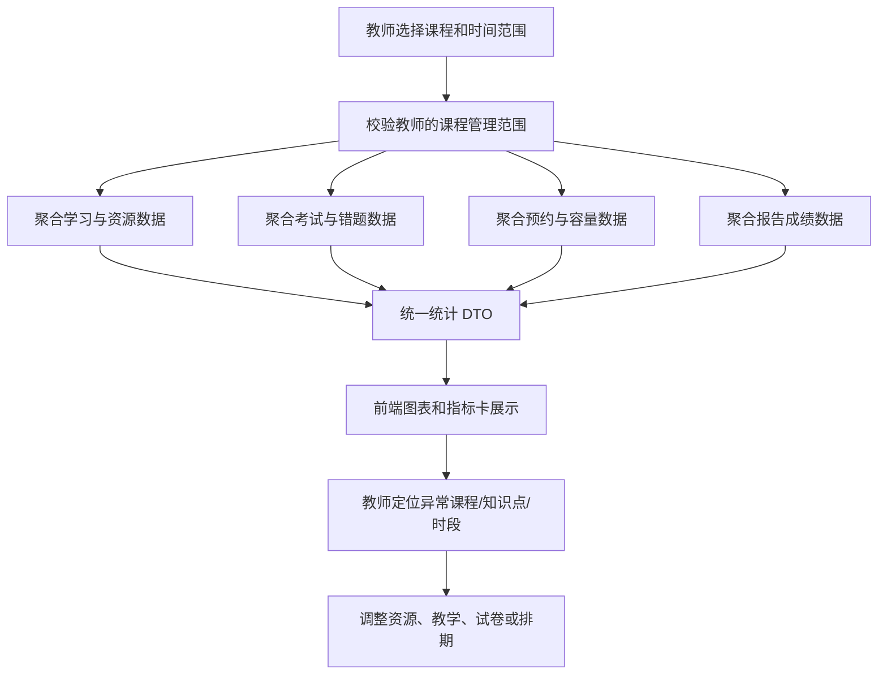
```mermaid
flowchart TD
    A["教师选择课程和时间范围"] --> B["校验教师的课程管理范围"]
    B --> C["聚合学习与资源数据"]
    B --> D["聚合考试与错题数据"]
    B --> E["聚合预约与容量数据"]
    B --> F["聚合报告成绩数据"]
    C --> G["统一统计 DTO"]
    D --> G
    E --> G
    F --> G
    G --> H["前端图表和指标卡展示"]
    H --> I["教师定位异常课程/知识点/时段"]
    I --> J["调整资源、教学、试卷或排期"]
```

### 12.3 关联数据表

| 统计主题 | 主要关联表 |
|---|---|
| 课程完成度与学习活跃 | `t_lab_course`、`t_course_student`、`t_learning_record`、`t_learning_task_record`、`t_step_learning_record` |
| 资源类型、热度与完成度 | `t_resource`、`t_resource_interaction`、`t_learning_record` |
| 考试通过率和知识点薄弱项 | `t_exam_paper`、`t_exam_record`、`t_exam_answer`、`t_question` |
| 预约趋势、状态和容量 | `t_lab_time_slot`、`t_reservation`、`t_experiment` |
| 报告成绩分布 | `t_report`、`t_report_score`、`t_report_score_item` |
| 用户和课程范围 | `t_user`、`t_lab_course`、`t_course_student` |

## 13. 后台治理、审计与定时提醒模块

### 13.1 模块说明

- **基本描述**：管理员维护用户、角色权限、公告，审核教师认证与资源投稿，查看操作日志，并运行或触发业务提醒。
- **对应需求**：平台需要具备持续运营能力、内容质量控制、身份可信性和关键管理操作追溯能力。
- **建设目的与意义**：把高风险管理动作集中在受控后台，形成“申请—审核—生效—审计”的治理链路。
- **主要建设内容**：用户管理、角色授权、权限树展示、公告治理、教师认证审核、资源投稿审核、操作日志检索、提醒任务执行。
- **模块特点**：管理接口使用细粒度权限码；审核必须记录操作者、时间和意见；日志以查询为主，不提供普通用户删除入口。
- **核心实现**：`UserController`、`RoleController`、`PermissionController`、`AdminPortalController`、`TeacherCertificationController`、`ResourceSubmissionController`。

### 13.2 管理治理流程

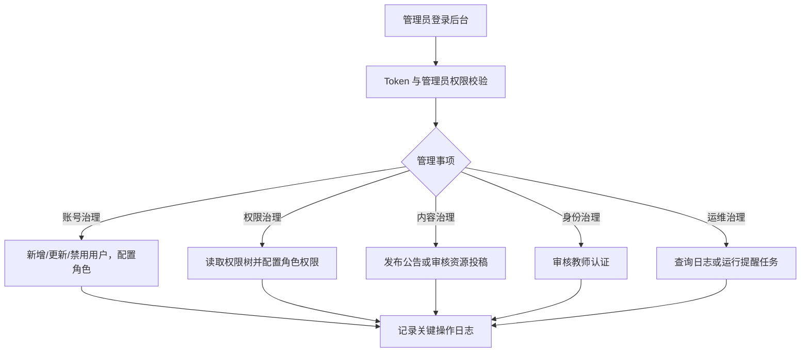
```mermaid
flowchart TD
    A["管理员登录后台"] --> B["Token 与管理员权限校验"]
    B --> C{"管理事项"}
    C -->|账号治理| D["新增/更新/禁用用户，配置角色"]
    C -->|权限治理| E["读取权限树并配置角色权限"]
    C -->|内容治理| F["发布公告或审核资源投稿"]
    C -->|身份治理| G["审核教师认证"]
    C -->|运维治理| H["查询日志或运行提醒任务"]
    D --> I["记录关键操作日志"]
    E --> I
    F --> I
    G --> I
    H --> I
```

### 13.3 关联数据表

| 数据表 | 作用 |
|---|---|
| `t_user`、`t_user_role` | 用户状态与角色分配 |
| `t_role`、`t_permission`、`t_role_permission` | 角色权限治理 |
| `t_portal_notice` | 公告草稿、发布和下线 |
| `t_teacher_certification` | 教师身份申请审核 |
| `t_resource_submission` | 公共资源投稿审核 |
| `t_operation_log` | 管理与关键业务操作审计 |
| `t_portal_message` | 审核结果和定时提醒的消息承载 |

## 14. 数据库模块归属总览

主 SQL 当前共定义 43 张表。下表用于检查每张表是否已纳入详细设计；一张表可被多个模块共同使用。

| 序号 | 数据表 | 主归属模块 |
|---:|---|---|
| 1 | `t_ai_chat_record` | AI 问答 |
| 2 | `t_class_invite` | 课堂成员管理 |
| 3 | `t_course_student` | 课堂成员管理 |
| 4 | `t_discussion_reply` | 讨论交流 |
| 5 | `t_discussion_topic` | 讨论交流 |
| 6 | `t_exam_answer` | 安全考试 |
| 7 | `t_exam_paper` | 安全考试 |
| 8 | `t_exam_paper_question` | 安全考试 |
| 9 | `t_exam_record` | 安全考试 |
| 10 | `t_experiment` | 实验与学习路径 |
| 11 | `t_experiment_admission` | 实验准入 |
| 12 | `t_experiment_step` | 实验与学习路径 |
| 13 | `t_lab_course` | 课堂管理 |
| 14 | `t_lab_time_slot` | 实验预约 |
| 15 | `t_step_learning_record` | 分步骤学习记录 |
| 16 | `t_learning_record` | 资源/实验学习记录 |
| 17 | `t_learning_task` | 学习任务 |
| 18 | `t_learning_task_record` | 学习任务记录 |
| 19 | `t_operation_log` | 后台治理与审计 |
| 20 | `t_permission` | 权限管理 |
| 21 | `t_portal_message` | 门户消息 |
| 22 | `t_portal_notice` | 门户公告 |
| 23 | `t_question` | 题库 |
| 24 | `t_recent_visit` | 门户最近访问 |
| 25 | `t_recommend_record` | 智能推荐 |
| 26 | `t_report` | 实验报告 |
| 27 | `t_report_rubric_item` | 报告量规 |
| 28 | `t_report_score` | 报告评分 |
| 29 | `t_report_score_item` | 报告评分明细 |
| 30 | `t_report_template` | 报告模板 |
| 31 | `t_reservation` | 实验预约 |
| 32 | `t_resource` | 教学资源 |
| 33 | `t_resource_interaction` | 资源互动 |
| 34 | `t_resource_submission` | 资源投稿 |
| 35 | `t_resource_timeline_note` | 资源时间轴笔记 |
| 36 | `t_role` | 角色管理 |
| 37 | `t_role_permission` | 角色权限关系 |
| 38 | `t_teacher_certification` | 教师认证 |
| 39 | `t_teaching_class` | 教学班 |
| 40 | `t_token` | 登录认证 |
| 41 | `t_user` | 用户账户 |
| 42 | `t_user_role` | 用户角色关系 |
| 43 | `t_user_shortcut` | 门户快捷入口 |

## 15. 跨模块关键约束

### 15.1 权限与数据范围

- 所有 `/api/**` 请求除登录和注册外均需有效 Token。
- 页面路由权限不能替代后端接口权限；所有变更类接口必须以后端校验为准。
- 教师权限除权限码外还需校验课程/实验所有权或管理范围。
- 学生只能读取和修改自己的学习、考试、预约和报告记录。
- 管理员审核操作必须保留审核人、审核时间和审核意见。

### 15.2 状态一致性

- 课程、资源、试卷未发布时，不应出现在学生正式入口。
- 考试成绩只有完成全部必要判分后才可最终决定通过与准入。
- 预约通过、拒绝或取消时，应同步维护时段容量占用，避免负数或超额。
- 报告只有提交后才能进入教师待评列表，退回后允许学生修改并再次提交。
- 审核类记录应采用明确状态迁移，避免通过直接覆盖记录丢失历史责任信息。

### 15.3 事务边界

- 试卷提交：答案落库、判分、考试记录汇总和准入更新应处于可靠事务边界。
- 预约审核/取消：预约状态与时段容量更新应原子完成。
- 报告量规评分：总评分与逐项评分应一致提交，汇总分由明细计算或严格校验。
- 角色授权：旧角色权限关系替换与新关系写入应整体成功或整体回滚。

## 附录 A：43 张数据表去重清单

`t_ai_chat_record`、`t_class_invite`、`t_course_student`、`t_discussion_reply`、`t_discussion_topic`、`t_exam_answer`、`t_exam_paper`、`t_exam_paper_question`、`t_exam_record`、`t_experiment`、`t_experiment_admission`、`t_experiment_step`、`t_lab_course`、`t_lab_time_slot`、`t_step_learning_record`、`t_learning_record`、`t_learning_task`、`t_learning_task_record`、`t_operation_log`、`t_permission`、`t_portal_message`、`t_portal_notice`、`t_question`、`t_recent_visit`、`t_recommend_record`、`t_report`、`t_report_rubric_item`、`t_report_score`、`t_report_score_item`、`t_report_template`、`t_reservation`、`t_resource`、`t_resource_interaction`、`t_resource_submission`、`t_resource_timeline_note`、`t_role`、`t_role_permission`、`t_teacher_certification`、`t_teaching_class`、`t_token`、`t_user`、`t_user_role`、`t_user_shortcut`。

## 附录 B：主要实现入口

| 模块 | 后端接口入口 | 前端主要入口 |
|---|---|---|
| 认证与账户 | `/api/auth`、`/api/users` | 登录、个人中心、用户管理 |
| 角色权限 | `/api/roles`、`/api/permissions` | 角色管理、权限管理 |
| 门户消息 | `/api/portal`、`/api/admin/notices` | 首页、消息中心、公告管理 |
| 课堂 | `/api/courses` | 我的课堂、课堂管理、课堂编辑 |
| 实验学习 | `/api/experiments`、`/api/learning-tasks`、`/api/learning-records` | 学习中心、章节学习 |
| 资源 | `/api/resources`、`/api/resource-submissions` | 资源中心、资源管理、投稿审核 |
| 考试 | `/api/questions`、`/api/exams/papers`、`/api/exams`、`/api/exams/statistics` | 题库、试卷编辑、答题、回看、批改 |
| 预约 | `/api/reservations` | 学生预约、教师预约审核 |
| 报告 | `/api/reports` | 学生报告与成绩、教师报告评阅 |
| 讨论 | `/api/discussions` | 学习交流中心 |
| 推荐与 AI | `/api/recommendations`、`/api/ai` | 首页/资源推荐及 AI 入口 |
| 看板与治理 | `/api/dashboard`、`/api/admin` | 教师看板、后台治理页面 |
